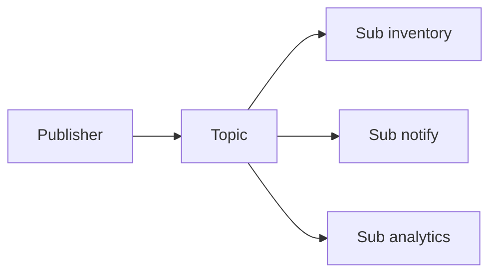

# Lesson 4.1 — Publisher and Subscriber

**Module:** 04 — Pub/Sub Architecture  
**Duration:** 25–35 minutes  
**BayLearn philosophy:** WHY → WHEN → HOW. Pattern first. Technology second.

---

## Learning outcomes

By the end of this lesson you will be able to:

1. Define pub/sub as senders of facts/notifications that do not enumerate consumers.
2. Contrast with competing consumers on a queue.
3. Name ownership of the topic versus ownership of each subscription.

---

## Enterprise scenario

Harbor’s checkout should not import inventory, email, and analytics SDKs. It should publish OrderCreated. Those teams subscribe independently. That is the organizational point of pub/sub.

> **Fiction notice:** Named companies in this course (Northbridge Bank, Harbor Retail, CareMesh Health, Atlas Manufacturing) are instructional fictions.

---

## WHY this exists

Publish/subscribe exists so a producer can announce without knowing who cares. The publisher owns the **contract of the notification**. Each subscriber owns its reaction, failure handling, and scale. This is how you avoid N-point-to-point callbacks from checkout to twenty systems.

---

## WHEN an Enterprise Architect uses it

- Multiple independent reactions to one fact or notification.
- Producer must not change when a new consumer appears.
- Consumers have different SLAs (email can lag; inventory cannot).

### When NOT to use it

- A single worker must do the work (queue/command).
- The producer needs an in-band result from all consumers (use saga/orchestration, not naive pub/sub).
- You are hiding a command inside an “event” that only one team is allowed to process.

---

## HOW — the pattern (vendor-neutral)

Publisher emits to a topic. Broker fans out. Each subscriber gets a copy (possibly filtered). Failures are isolated if each subscriber has its own queue. The publisher’s success is “the broker accepted the publish,” not “email was sent.”

### Architecture diagram

---

## HOW — AWS implementation (after the pattern)

Amazon SNS topics plus SQS subscriptions is the classic AWS mapping. EventBridge is often a better event bus when you need content-based routing across domains (Module 5). Lab 4 uses SNS → three SQS queues to make isolation tangible.

Do not start here. If you cannot explain the requirement and pattern without naming an AWS service, you are not ready to select technology.

---

## Anti-patterns

- Publisher waiting synchronously for all subscribers.
- One shared queue for all subscriber types.

---

## Tradeoffs

| Dimension | Benefit | Cost / risk |
|-----------|---------|-------------|
| Pub/sub | Independent consumers | Harder end-to-end transactional guarantees |
| Direct calls | Easy to see the chain | Checkout owns everyone else's outages |

---

## Architecture decision prompt

If analytics is down, should checkout fail? What does that imply about coupling?

Write four sentences: the requirement, the integration characteristics, the pattern, and why the rejected options fail the NFRs.

---

## Knowledge check

**Q1.** What is the publisher responsible for after a successful publish?

*Answer.* The durability of the notification into the broker per the topic’s SLA—not the success of every subscriber’s business logic.

---

## Architect's note

If adding a consumer requires a deploy of the producer, you do not have pub/sub.

---

## Next

Complete any architecture challenge attached to this lesson in the course player. Record an ADR fragment if the decision would survive a design review.
