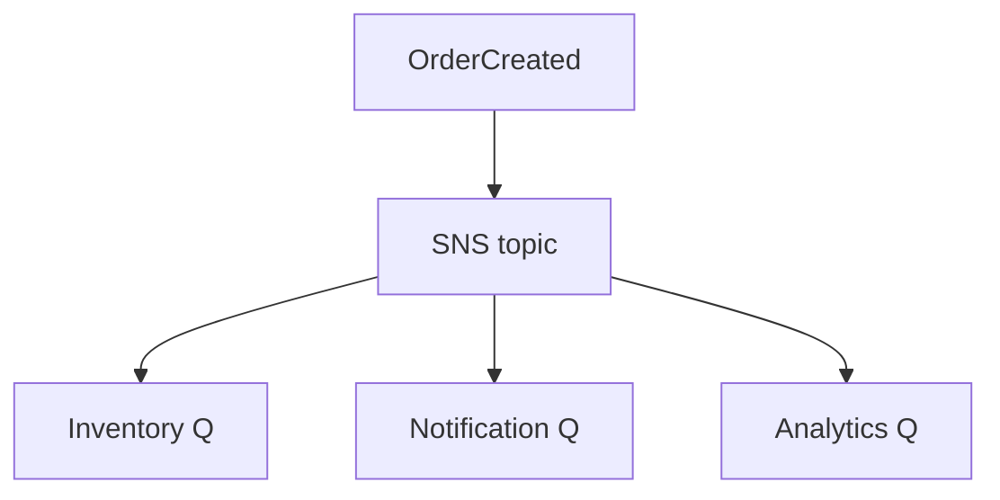

# Lesson 4.2 — Fan-out

**Module:** 04 — Pub/Sub Architecture  
**Duration:** 25–35 minutes  
**BayLearn philosophy:** WHY → WHEN → HOW. Pattern first. Technology second.

---

## Learning outcomes

By the end of this lesson you will be able to:

1. Design fan-out so one slow subscriber cannot block others.
2. Give each subscriber its own buffer.
3. Measure fan-out as a reliability graph, not a slide.

---

## Enterprise scenario

SNS delivered to three HTTPS endpoints. The email endpoint hung. Depending on configuration, you can stall or retry in ways that surprise you. Fan-out to queues is the enterprise default for a reason.

> **Fiction notice:** Named companies in this course (Northbridge Bank, Harbor Retail, CareMesh Health, Atlas Manufacturing) are instructional fictions.

---

## WHY this exists

Fan-out copies a message to N destinations. The architecture question is isolation: separate retry, DLQ, and scaling per destination. Fan-out to Lambda directly is convenient; fan-out to SQS in front of Lambda is usually safer for back-pressure and replay.

---

## WHEN an Enterprise Architect uses it

- N independent consumers.
- When you would otherwise loop HTTP calls in the producer.

### When NOT to use it

- Fan-out of huge payloads (claim-check first).
- Fan-out of secrets to destinations that should not see them (filter/minimize).

---

## HOW — the pattern (vendor-neutral)

Pattern: topic → per-consumer queue → consumer. Apply filters so finance does not get marketing events. Encrypt. Do not put PII on a topic with 40 casual subscribers.

### Architecture diagram

---

## HOW — AWS implementation (after the pattern)

SNS fan-out to SQS, Lambda, HTTP, email. Prefer SQS subscriptions for operational control. Lab 4 implements three queues.

Do not start here. If you cannot explain the requirement and pattern without naming an AWS service, you are not ready to select technology.

---

## Anti-patterns

- All consumers sharing one queue and peeking by type.
- Unfiltered PII blast.

---

## Tradeoffs

| Dimension | Benefit | Cost / risk |
|-----------|---------|-------------|
| Queue per subscriber | Isolation and replay | More Terraform |
| HTTP fan-out | Fewer resources | Coupled timeouts and weaker replay |

---

## Architecture decision prompt

Draw blast radius if the topic policy allows any account to subscribe.

Write four sentences: the requirement, the integration characteristics, the pattern, and why the rejected options fail the NFRs.

---

## Knowledge check

**Q1.** Why is a queue per subscriber the default enterprise fan-out?

*Answer.* Independent retry, DLQ, scaling, and the publisher does not wait on HTTP timeouts.

---

## Architect's note

Fan-out is a security decision as much as a scaling decision.

---

## Next

Complete any architecture challenge attached to this lesson in the course player. Record an ADR fragment if the decision would survive a design review.
