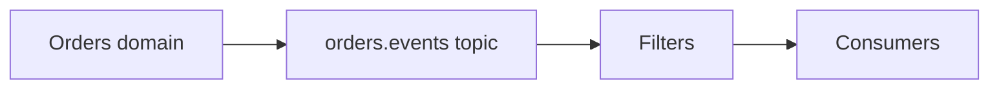

# Lesson 4.3 — Topics

**Module:** 04 — Pub/Sub Architecture  
**Duration:** 25–35 minutes  
**BayLearn philosophy:** WHY → WHEN → HOW. Pattern first. Technology second.

---

## Learning outcomes

By the end of this lesson you will be able to:

1. Name topics after business facts, not after teams.
2. Avoid a single mega-topic and a million micro-topics.
3. Set retention, encryption, and access at topic grain.

---

## Enterprise scenario

A company created topic-john-test and topic-orders-final-v3-real. Nobody could find the contract. Topics are APIs.

> **Fiction notice:** Named companies in this course (Northbridge Bank, Harbor Retail, CareMesh Health, Atlas Manufacturing) are instructional fictions.

---

## WHY this exists

A topic is a named channel with a contract. Good names: order-created, payment-authorized. Ownership sits with the domain that owns the fact. Access policies are part of the design: who may publish, who may subscribe. Too coarse (everything on bus) recreates an ESB. Too fine (topic per field change) recreates a mesh.

---

## WHEN an Enterprise Architect uses it

- Stable business facts with multiple consumers.
- When you need a permission boundary around a class of notifications.

### When NOT to use it

- A topic per environment hacked into the name instead of using accounts/prefixes.
- Reusing a topic for commands and facts.

---

## HOW — the pattern (vendor-neutral)

Treat the topic like an API product: schema, version, owners, SLOs. Document payload (or claim-check pointer). Prefer a modest set of domain topics. Use filters for subtypes.

### Architecture diagram

---

## HOW — AWS implementation (after the pattern)

SNS topic resource policies, KMS, FIFO topics when you truly need ordered fan-out. Event buses (Module 5) may replace many topics when routing is content-based and cross-domain.

Do not start here. If you cannot explain the requirement and pattern without naming an AWS service, you are not ready to select technology.

---

## Anti-patterns

- topic-final-final.
- Publishers from any team without review.

---

## Tradeoffs

| Dimension | Benefit | Cost / risk |
|-----------|---------|-------------|
| Few topics + filters | Simpler IAM surface | Noisy if filters are sloppy |
| Many topics | Clear contracts | Topic sprawl and missed subscribers |

---

## Architecture decision prompt

Should OrderCreated and OrderCancelled share a topic with a type field, or be two topics? What happens to IAM and filters?

Write four sentences: the requirement, the integration characteristics, the pattern, and why the rejected options fail the NFRs.

---

## Knowledge check

**Q1.** Who should own the OrderCreated topic?

*Answer.* The orders domain that is the source of truth for that fact—not the integration team by default.

---

## Architect's note

Put topic contracts in git next to OpenAPI. They are the same kind of artifact.

---

## Next

Complete any architecture challenge attached to this lesson in the course player. Record an ADR fragment if the decision would survive a design review.
