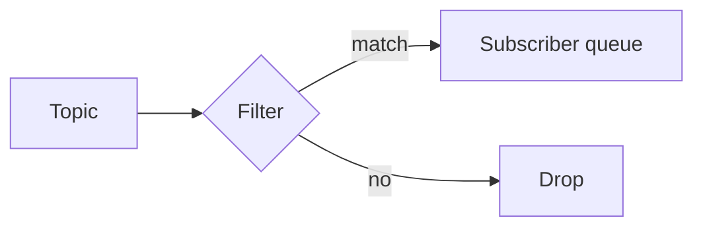

# Lesson 4.4 — Filtering

**Module:** 04 — Pub/Sub Architecture  
**Duration:** 25–35 minutes  
**BayLearn philosophy:** WHY → WHEN → HOW. Pattern first. Technology second.

---

## Learning outcomes

By the end of this lesson you will be able to:

1. Use server-side filters to reduce fan-out cost and data exposure.
2. Keep filters coarse enough to be understandable.
3. Do not replace schema versioning with filter spaghetti.

---

## Enterprise scenario

Analytics only needs orders over $500. If you deliver everything, you pay to move and store noise—and you widen the PII blast radius.

> **Fiction notice:** Named companies in this course (Northbridge Bank, Harbor Retail, CareMesh Health, Atlas Manufacturing) are instructional fictions.

---

## WHY this exists

Filters are predicates on notification attributes or payload (depending on the broker). They are a performance and security control. They are a poor substitute for splitting truly different facts. Over-filtering makes debugging “why didn’t I get it?” expensive.

---

## WHEN an Enterprise Architect uses it

- Subscribers that need a subset of a stable fact.
- Reducing sensitive fields by not subscribing to events that contain them—better: minimize the payload.

### When NOT to use it

- Encoding the entire business process in filter syntax.
- Filters so specific they break when a new optional field appears.

---

## HOW — the pattern (vendor-neutral)

Put stable attributes in metadata (orderType, country, amountBand) so filters do not parse opaque blobs. Test filters as code. Document them for each subscription.

### Architecture diagram

---

## HOW — AWS implementation (after the pattern)

SNS subscription filter policies; EventBridge pattern matching (richer). Lab 4 can start without filters, then add an attribute so analytics ignores test orders.

Do not start here. If you cannot explain the requirement and pattern without naming an AWS service, you are not ready to select technology.

---

## Anti-patterns

- Parsing JSON in filters when attributes would do.
- No metric for filtered-out count.

---

## Tradeoffs

| Dimension | Benefit | Cost / risk |
|-----------|---------|-------------|
| Filters | Less noise, less data | Invisible delivery failures |
| Separate topics | Obvious contracts | More artifacts |

---

## Architecture decision prompt

A filter drops “TEST” orders. A partner uses customer name TESTCO. What is the defect class?

Write four sentences: the requirement, the integration characteristics, the pattern, and why the rejected options fail the NFRs.

---

## Knowledge check

**Q1.** Are filters a security boundary?

*Answer.* They reduce exposure but are not a substitute for authorization and payload minimization. Misconfiguration can still leak.

---

## Architect's note

Always log a sample of unmatched events in non-prod when bringing a new subscriber live.

---

## Next

Complete any architecture challenge attached to this lesson in the course player. Record an ADR fragment if the decision would survive a design review.
