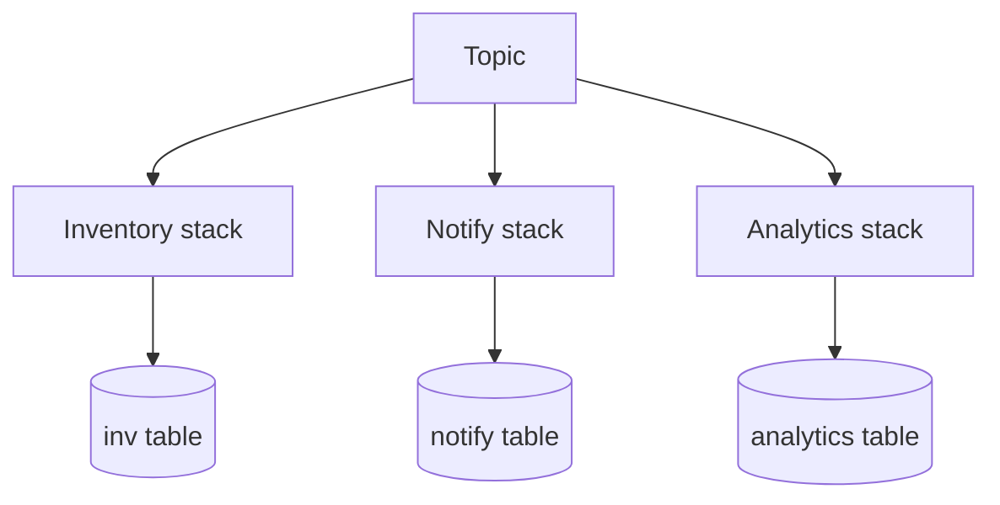

# Lesson 4.5 — Independent Consumers

**Module:** 04 — Pub/Sub Architecture  
**Duration:** 25–35 minutes  
**BayLearn philosophy:** WHY → WHEN → HOW. Pattern first. Technology second.

---

## Learning outcomes

By the end of this lesson you will be able to:

1. Prove that consumer failure is isolated.
2. Give each consumer its own idempotency and DLQ.
3. Avoid shared databases as a secret coupling between “independent” consumers.

---

## Enterprise scenario

Inventory and email “independently” subscribed but both wrote the same DynamoDB row with overlapping keys. Email outages locked inventory. Independence is a property of failure and of data ownership.

> **Fiction notice:** Named companies in this course (Northbridge Bank, Harbor Retail, CareMesh Health, Atlas Manufacturing) are instructional fictions.

---

## WHY this exists

Independence means: own queue, own compute, own datastore for *their* projection, own alerts, own deploy. They may read the same event contract. They may not share a lock table casually. If a saga requires a joint outcome, that is a different pattern (Module 10)—do not fake it with pub/sub plus a shared row.

---

## WHEN an Enterprise Architect uses it

- Truly different reasons to react.
- Different scale and languages.

### When NOT to use it

- When a single atomic business transaction must span them (use orchestration or a two-phase design).

---

## HOW — the pattern (vendor-neutral)

In Lab 4, kill the notification consumer and show inventory still drains. That experiment is the lesson. Then inspect data ownership: three tables or three prefixes, not one OrdersWorking table everyone fights over.

### Architecture diagram

---

## HOW — AWS implementation (after the pattern)

Three Lambdas, three SQS, optionally three DynamoDB tables. IAM so notify cannot write inventory items. This is also a security lesson.

Do not start here. If you cannot explain the requirement and pattern without naming an AWS service, you are not ready to select technology.

---

## Anti-patterns

- Shared IAM role for all consumers.
- A “misc” Lambda that does all three jobs.

---

## Tradeoffs

| Dimension | Benefit | Cost / risk |
|-----------|---------|-------------|
| Isolated stacks | Failure isolation | Duplicated projection logic |
| Shared working table | Less duplication | Coupled outages and schema fights |

---

## Architecture decision prompt

If analytics needs a complete copy of the order, should it call the order API or consume the event payload? What is the coupling?

Write four sentences: the requirement, the integration characteristics, the pattern, and why the rejected options fail the NFRs.

---

## Knowledge check

**Q1.** What experiment proves independence?

*Answer.* Stop one consumer; others continue; publisher still succeeds; DLQ only for the stopped path if messages expire retries.

---

## Architect's note

Lab 4’s grading should include the kill-one-consumer test.

---

## Next

Complete any architecture challenge attached to this lesson in the course player. Record an ADR fragment if the decision would survive a design review.
