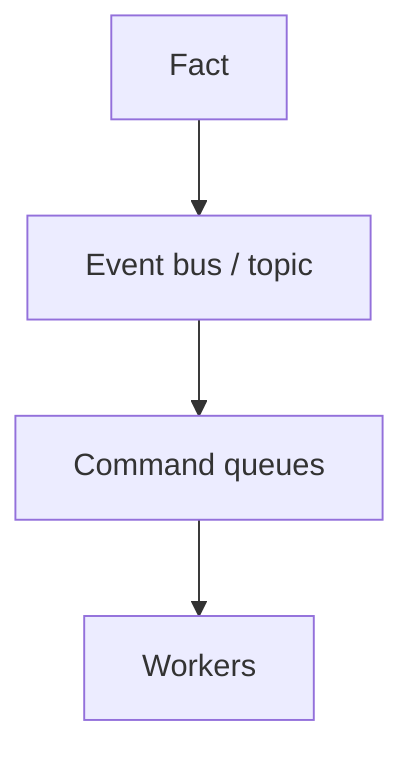

# Lesson 4.6 — Pub/Sub vs Event Bus vs Queue

**Module:** 04 — Pub/Sub Architecture  
**Duration:** 25–35 minutes  
**BayLearn philosophy:** WHY → WHEN → HOW. Pattern first. Technology second.

---

## Learning outcomes

By the end of this lesson you will be able to:

1. Choose SNS-style topics vs EventBridge-style buses vs SQS without cargo-culting.
2. Use a decision table the rest of the course will reuse.
3. Explain why all three might appear in one platform.

---

## Enterprise scenario

A platform team mandated EventBridge for everything, including “resize this image” commands. Commands sat on a bus with 70 rules. Operators could not see work. The tool was not wrong; the style was.

> **Fiction notice:** Named companies in this course (Northbridge Bank, Harbor Retail, CareMesh Health, Atlas Manufacturing) are instructional fictions.

---

## WHY this exists

Queues carry commands to competing workers. Topics fan out notifications to known subscription types. Event buses route facts using content and metadata across many domains with rules. A mature platform uses all three. The decision framework from Module 1 still applies: command vs fact, cardinality, routing need, ops skill.

---

## WHEN an Enterprise Architect uses it

- Queue: one work type, back-pressure.
- Topic: simple fan-out of a named notification.
- Bus: many event types, content-based routing, archive/replay (Module 5).

### When NOT to use it

- Bus for pixel-resize jobs.
- Queue for 40 unrelated teams peeking.
- Topic for a single consumer (probably just a queue).

---

## HOW — the pattern (vendor-neutral)

Write the table in the ADR. It is acceptable to publish an event to a bus *and* have a rule send a command to SQS. That composition is normal: fact then work.

### Architecture diagram

---

## HOW — AWS implementation (after the pattern)

SNS + SQS (Lab 4), EventBridge + SQS/Lambda (Lab 5), SQS alone (Lab 3). Step Functions when you need orchestration rather than notification.

Do not start here. If you cannot explain the requirement and pattern without naming an AWS service, you are not ready to select technology.

---

## Anti-patterns

- One AWS service mandated enterprise-wide.
- Renaming commands to events to satisfy a standard.

---

## Tradeoffs

| Dimension | Benefit | Cost / risk |
|-----------|---------|-------------|
| All on one bus | Unified routing | Ops fog and style confusion |
| Right tool per hop | Clarity | More moving parts to document |

---

## Architecture decision prompt

OrderCreated should notify three teams and also start a payment command. Sketch topic vs bus vs queue for each hop.

Write four sentences: the requirement, the integration characteristics, the pattern, and why the rejected options fail the NFRs.

---

## Knowledge check

**Q1.** Can a rule on an event bus create a command?

*Answer.* Yes. That is a common composition. The event remains a fact; the SQS message is the command.

---

## Architect's note

You will reuse this comparison in Module 14’s challenges. Memorize the table, not the ARNs.

---

## Next

Complete any architecture challenge attached to this lesson in the course player. Record an ADR fragment if the decision would survive a design review.
