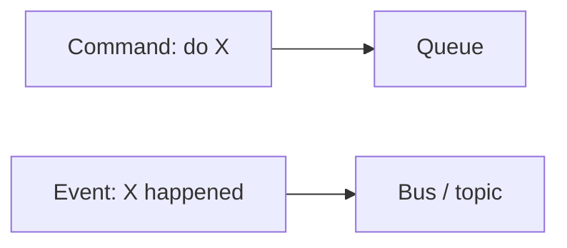

# Lesson 5.1 — Events vs Messages

**Module:** 05 — Event-Driven Architecture  
**Duration:** 25–35 minutes  
**BayLearn philosophy:** WHY → WHEN → HOW. Pattern first. Technology second.

---

## Learning outcomes

By the end of this lesson you will be able to:

1. Define an event as an immutable fact about something that happened.
2. Define a message/command as an intent that someone must do.
3. Spot “pseudo-events” that are commands in disguise.

---

## Enterprise scenario

PaymentAuthorized is a fact. AuthorizePayment is a command. Teams that name both “events” cannot design retries. Facts can fan out. Commands need a responsible worker and often a DLQ.

> **Fiction notice:** Named companies in this course (Northbridge Bank, Harbor Retail, CareMesh Health, Atlas Manufacturing) are instructional fictions.

---

## WHY this exists

Events describe the past: OrderCreated, FileReceived. They should not say “please do.” Commands describe the future work: ProcessFile, ChargeCard. Mixing them causes duplicate side effects (everyone “helps”) or lost work (nobody is on the hook). Event-driven architecture is not “we use EventBridge.” It is facts + independent reactions + eventual consistency you can live with.

---

## WHEN an Enterprise Architect uses it

- Facts with multiple reactions.
- Auditability of what happened.
- Decoupling producers from consumer set.

### When NOT to use it

- User is waiting for a single result in 200 ms (API).
- Exactly one worker must perform a side effect (queue).
- You need a distributed transaction illusion without a saga design.

---

## HOW — the pattern (vendor-neutral)

Name events in past tense. Include event ID, time, producer, entity IDs, version, and payload or claim-check. Do not include “nextHopUrl” that only one consumer understands. If you need a next hop, that is orchestration.

### Architecture diagram

---

## HOW — AWS implementation (after the pattern)

EventBridge events vs SQS messages vs SNS notifications. The AWS object is not the definition. Lab 5 uses facts: OrderCreated, PaymentAuthorized, InventoryReserved, OrderCompleted.

Do not start here. If you cannot explain the requirement and pattern without naming an AWS service, you are not ready to select technology.

---

## Anti-patterns

- Event payload that is actually a stored procedure call.
- Consumers that ignore the fact and always call back the producer.

---

## Tradeoffs

| Dimension | Benefit | Cost / risk |
|-----------|---------|-------------|
| Facts | Many consumers, audit | Eventual consistency |
| Commands | Clear ownership of work | Producer knows a worker type |

---

## Architecture decision prompt

Is “SendEmail” an event? What would the fact be instead, and who commands the email worker?

Write four sentences: the requirement, the integration characteristics, the pattern, and why the rejected options fail the NFRs.

---

## Knowledge check

**Q1.** How should events be named?

*Answer.* Past-tense business facts (PaymentAuthorized), not verbs (DoPayment).

---

## Architect's note

If you can replace the event with POST /pleaseDoThis, it was a command.

---

## Next

Complete any architecture challenge attached to this lesson in the course player. Record an ADR fragment if the decision would survive a design review.
