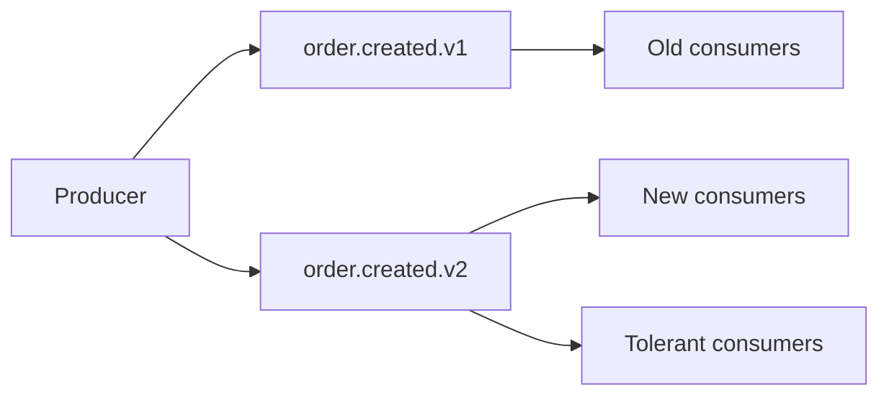

# Lesson 5.10 — Event Versioning

**Module:** 05 — Event-Driven Architecture  
**Duration:** 25–35 minutes  
**BayLearn philosophy:** WHY → WHEN → HOW. Pattern first. Technology second.

---

## Learning outcomes

By the end of this lesson you will be able to:

1. Version event types explicitly.
2. Run dual publishers only with a plan.
3. Keep consumers tolerant of additive fields.

---

## Enterprise scenario

v1 had amount as string; v2 as number. Half the consumers broke on a Tuesday. Versioning without dual-run is a flag day.

> **Fiction notice:** Named companies in this course (Northbridge Bank, Harbor Retail, CareMesh Health, Atlas Manufacturing) are instructional fictions.

---

## WHY this exists

Event types are contracts. Additive optional fields: bump a minor if you even number them; consumers ignore unknowns. Semantic change: new type (order.created.v2) or a new field with a new meaning plus a period of dual publish. Remove fields only after consumers are gone (metrics!).

---

## WHEN an Enterprise Architect uses it

- Any event that already has a second consumer.
- When you must change types or required fields.

### When NOT to use it

- Version in the payload only with no type change and no docs.
- Infinite dual publish.

---

## HOW — the pattern (vendor-neutral)

Include version in the type name or envelope. Consumers subscribe to the versions they support. Producers dual-publish during migration. Measure v1 vs v2. Stop v1 with an ADR.

### Architecture diagram

---

## HOW — AWS implementation (after the pattern)

EventBridge detail-type can carry the version. Schema registry versions. Lab 5 starts at v1; an architecture challenge asks you to add a field without breaking notification.

Do not start here. If you cannot explain the requirement and pattern without naming an AWS service, you are not ready to select technology.

---

## Anti-patterns

- Reuse of event IDs across versions with different meanings.
- No example payloads for v2.

---

## Tradeoffs

| Dimension | Benefit | Cost / risk |
|-----------|---------|-------------|
| Explicit types per version | Clear routing | More rules |
| Single type + hidden meaning change | Looks simple | Silent corruption |

---

## Architecture decision prompt

You must change currency from implied USD to an explicit code. Is that compatible? How do you dual-run?

Write four sentences: the requirement, the integration characteristics, the pattern, and why the rejected options fail the NFRs.

---

## Knowledge check

**Q1.** What metric tells you you can sunset v1?

*Answer.* Zero healthy consumers (or zero traffic) on v1 plus a written owner sign-off.

---

## Architect's note

Event versioning is API versioning with more spectators. Be stricter, not looser.

---

## Next

Complete any architecture challenge attached to this lesson in the course player. Record an ADR fragment if the decision would survive a design review.
