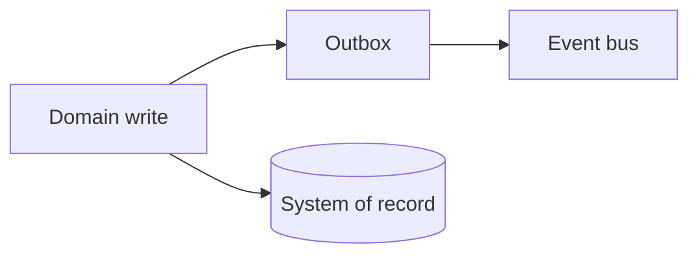

# Lesson 5.2 — Event Producers

**Module:** 05 — Event-Driven Architecture  
**Duration:** 25–35 minutes  
**BayLearn philosophy:** WHY → WHEN → HOW. Pattern first. Technology second.

---

## Learning outcomes

By the end of this lesson you will be able to:

1. Place production of events at the system of record after a successful state change.
2. Avoid dual-write between DB and bus.
3. Include identity of the producer in the envelope.

---

## Enterprise scenario

Checkout published OrderCreated before the order row committed. Payments authorized a ghost order. Producer timing is a correctness problem.

> **Fiction notice:** Named companies in this course (Northbridge Bank, Harbor Retail, CareMesh Health, Atlas Manufacturing) are instructional fictions.

---

## WHY this exists

The producer is the authority for the fact. It should emit **after** the state change is durable, or atomically via outbox/change-data-capture. Producers must not lie (publishing success on a failed write). They must version the schema. They should not wait for consumers.

---

## WHEN an Enterprise Architect uses it

- Domain services that own entities.
- File landing zones that own “file received” facts.
- Integration layers that translate partner facts into internal facts (anti-corruption).

### When NOT to use it

- Random Lambdas that guess domain state.
- Consumers re-publishing the same fact under a new name without adding meaning (noise).

---

## HOW — the pattern (vendor-neutral)

Outbox, CDC, or “write event store first” are the honest options. Include occurredAt from the domain, not only the broker timestamp. Sign or at least hash if auditors will care (payments, health).

### Architecture diagram

---

## HOW — AWS implementation (after the pattern)

DynamoDB Streams / EventBridge Pipes, outbox relay, or application publish after transact-write. Lab 5 may start with a simple put-event for learning, then the architecture questions must call out the dual-write risk.

Do not start here. If you cannot explain the requirement and pattern without naming an AWS service, you are not ready to select technology.

---

## Anti-patterns

- Consumers producing “OrderCreated” again when they finish their slice.
- Unsigned payment facts on a public bus.

---

## Tradeoffs

| Dimension | Benefit | Cost / risk |
|-----------|---------|-------------|
| After-commit emit | No ghost facts | Tiny window if process dies—mitigate with outbox |
| Before-commit emit | Faster notify | Ghost facts and reconciliation pain |

---

## Architecture decision prompt

If the producer emits twice because of a retry, what must every consumer already be?

Write four sentences: the requirement, the integration characteristics, the pattern, and why the rejected options fail the NFRs.

---

## Knowledge check

**Q1.** Who may produce OrderCreated?

*Answer.* The orders system of record (or a dedicated anti-corruption publisher it owns)—not every service that heard a rumor.

---

## Architect's note

Producer quality determines whether EDA is an audit log or a rumor mill.

---

## Next

Complete any architecture challenge attached to this lesson in the course player. Record an ADR fragment if the decision would survive a design review.
