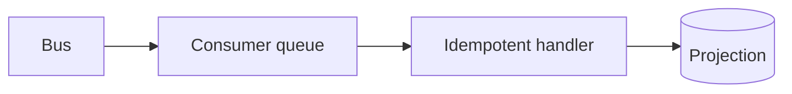

# Lesson 5.3 — Event Consumers

**Module:** 05 — Event-Driven Architecture  
**Duration:** 25–35 minutes  
**BayLearn philosophy:** WHY → WHEN → HOW. Pattern first. Technology second.

---

## Learning outcomes

By the end of this lesson you will be able to:

1. Build consumers as idempotent projectors or command issuers.
2. Keep consumer state in a store they own.
3. Handle late, duplicate, and out-of-order events.

---

## Enterprise scenario

Inventory reserved twice on duplicate OrderCreated. Stock went negative. The consumer was a tutorial Lambda.

> **Fiction notice:** Named companies in this course (Northbridge Bank, Harbor Retail, CareMesh Health, Atlas Manufacturing) are instructional fictions.

---

## WHY this exists

Consumers translate facts into *their* world: update a projection, send a command, start a workflow. They must tolerate at-least-once facts. They should not become mini-systems-of-record for someone else’s entity. If they need a command performed, they send a message to a queue they own or call an API with an idempotency key.

---

## WHEN an Enterprise Architect uses it

- Projections, notifications, triggering workflows, analytics.
- When independent reaction is actually desired.

### When NOT to use it

- When they must lock the producer’s database.
- When they need a synchronous answer back to the original user without a status model.

---

## HOW — the pattern (vendor-neutral)

Idempotency store keyed by event ID. Version checks on the entity. Timeouts and DLQ. Observability with the correlation ID from the producer. Consumer-specific alarms (lag, DLQ).

### Architecture diagram

---

## HOW — AWS implementation (after the pattern)

EventBridge targets: Lambda, SQS, Step Functions. Prefer SQS in front of Lambda for retry control. Lab 5 wires payment, inventory, and notification consumers.

Do not start here. If you cannot explain the requirement and pattern without naming an AWS service, you are not ready to select technology.

---

## Anti-patterns

- Dropping event IDs.
- Calling a non-idempotent payment API from the consumer.

---

## Tradeoffs

| Dimension | Benefit | Cost / risk |
|-----------|---------|-------------|
| Queue in front of consumer | Control and replay | More latency |
| Direct Lambda target | Simple | Retry semantics harder to reason |

---

## Architecture decision prompt

PaymentAuthorized arrives twice. What row in DynamoDB proves you will not authorize twice?

Write four sentences: the requirement, the integration characteristics, the pattern, and why the rejected options fail the NFRs.

---

## Knowledge check

**Q1.** What is a projector?

*Answer.* A consumer that updates a read model from events without claiming to be the system of record for the producer’s entity.

---

## Architect's note

Every Lab 5 consumer is a chance to practice Lesson 2.11 and 3.4 again. That repetition is intentional.

---

## Next

Complete any architecture challenge attached to this lesson in the course player. Record an ADR fragment if the decision would survive a design review.
