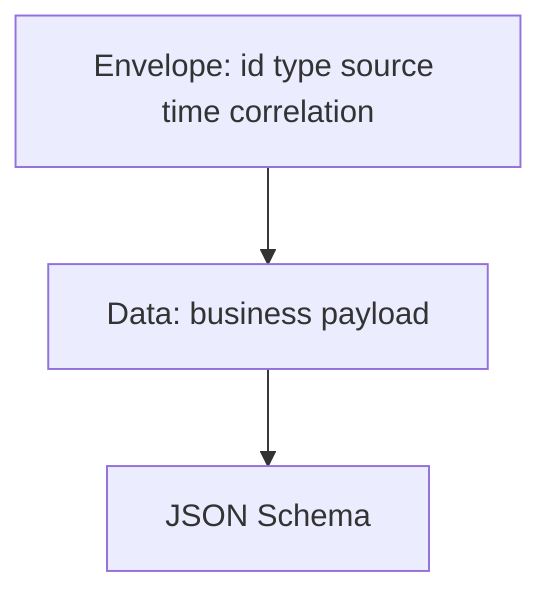

# Lesson 5.4 — Event Schemas

**Module:** 05 — Event-Driven Architecture  
**Duration:** 25–35 minutes  
**BayLearn philosophy:** WHY → WHEN → HOW. Pattern first. Technology second.

---

## Learning outcomes

By the end of this lesson you will be able to:

1. Publish a schema registry-like contract for events.
2. Include envelope vs data, compatibility rules, and examples.
3. Reject unschematized “JSON blobs” on enterprise buses.

---

## Enterprise scenario

Two teams used customerId vs customer_id vs custNo. Analytics joined garbage. Schema is the event’s OpenAPI.

> **Fiction notice:** Named companies in this course (Northbridge Bank, Harbor Retail, CareMesh Health, Atlas Manufacturing) are instructional fictions.

---

## WHY this exists

Event schemas need an envelope (id, type, source, time, specversion) and a data payload. Compatibility: additive optional fields are usually OK; renaming is a new version. Examples of invalid events should exist. Producers validate before put; consumers validate before effect (defense in depth).

---

## WHEN an Enterprise Architect uses it

- Any shared bus.
- Any event that crosses team or compliance boundaries.

### When NOT to use it

- Pair-programming a one-off internal ping.
- Using schema to encode the entire workflow (keep facts small).

---

## HOW — the pattern (vendor-neutral)

Adopt a convention (CloudEvents-like) so tracing and routing work. Version the type name (order.created.v1). Store schemas in git. CI: producer tests emit valid examples; consumer tests parse them.

### Architecture diagram

---

## HOW — AWS implementation (after the pattern)

EventBridge schema registry can discover schemas; do not rely on discovery as governance. Prefer explicit schemas in the repo (sample-data/events). Lab 5 events are defined as JSON Schema in sample-data.

Do not start here. If you cannot explain the requirement and pattern without naming an AWS service, you are not ready to select technology.

---

## Anti-patterns

- PII in the envelope for convenience.
- Type names that include environment (OrderCreated-dev).

---

## Tradeoffs

| Dimension | Benefit | Cost / risk |
|-----------|---------|-------------|
| Strict registry | Safe evolution | Process overhead |
| Free JSON | Fast | Unjoinable data and poison events |

---

## Architecture decision prompt

You need a new field paymentMethod. v1 additive or v2? Who does not deploy in time?

Write four sentences: the requirement, the integration characteristics, the pattern, and why the rejected options fail the NFRs.

---

## Knowledge check

**Q1.** Why separate envelope from data?

*Answer.* Routing, tracing, and replay tools should not need to understand every domain payload.

---

## Architect's note

sample-data/events is part of the contract, not a convenience folder.

---

## Next

Complete any architecture challenge attached to this lesson in the course player. Record an ADR fragment if the decision would survive a design review.
