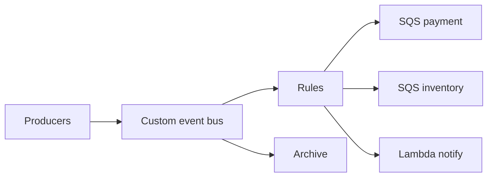

# Lesson 5.5 — EventBridge

**Module:** 05 — Event-Driven Architecture  
**Duration:** 25–35 minutes  
**BayLearn philosophy:** WHY → WHEN → HOW. Pattern first. Technology second.

---

## Learning outcomes

By the end of this lesson you will be able to:

1. Describe an event bus as a routed fact backbone, not a queue.
2. Use custom buses per domain or enterprise with a plan.
3. Know archive/replay as a first-class capability.

---

## Enterprise scenario

A default bus with 200 rules became unreadable. A custom bus per domain with a clearly owned integration bus for cross-domain facts is an architecture, not a setting.

> **Fiction notice:** Named companies in this course (Northbridge Bank, Harbor Retail, CareMesh Health, Atlas Manufacturing) are instructional fictions.

---

## WHY this exists

EventBridge is AWS’s event router: buses, rules (patterns), targets, archives, pipes. Conceptually it is closer to an enterprise event backbone than to SQS. You still need the styles: facts on the bus, commands on queues. Bus strategy (one vs many) is an ADR: blast radius, IAM, noise, cost of rules.

---

## WHEN an Enterprise Architect uses it

- Cross-service facts inside the estate.
- SaaS/AWS service events you want to route (with care).
- When you need archive and replay.

### When NOT to use it

- High-volume clickstream where a stream processor is cheaper.
- Large payloads (claim-check to S3).
- Partner SFTP (file style) pretending to be events without a landing fact.

---

## HOW — the pattern (vendor-neutral)

Choose bus topology. Put IAM so only Orders can put OrderCreated. Use rules to fan out to SQS. Enable archive on the bus that holds legally relevant facts. Watch cost of custom events and CloudWatch.

### Architecture diagram

---

## HOW — AWS implementation (after the pattern)

Amazon EventBridge custom bus, rules, targets, archive, schema registry, pipes from SQS/DynamoDB. Lab 5 builds the happy path. Module 11 will break it.

Do not start here. If you cannot explain the requirement and pattern without naming an AWS service, you are not ready to select technology.

---

## Anti-patterns

- Putting 256 KB payloads on the bus as a habit.
- Everyone PutEvents to the default bus with star IAM.

---

## Tradeoffs

| Dimension | Benefit | Cost / risk |
|-----------|---------|-------------|
| Single bus | Easy discovery | Noisy neighbors and IAM sprawl |
| Domain buses | Clear ownership | Cross-domain bridging to design |

---

## Architecture decision prompt

One enterprise bus vs bus-per-domain: what IAM and operational problem does each solve?

Write four sentences: the requirement, the integration characteristics, the pattern, and why the rejected options fail the NFRs.

---

## Knowledge check

**Q1.** Is EventBridge a replacement for SQS?

*Answer.* No. It routes facts. SQS still buffers commands and isolates consumers.

---

## Architect's note

If you cannot name who may PutEvents of type X, the bus is a rumor mill (again).

---

## Next

Complete any architecture challenge attached to this lesson in the course player. Record an ADR fragment if the decision would survive a design review.
