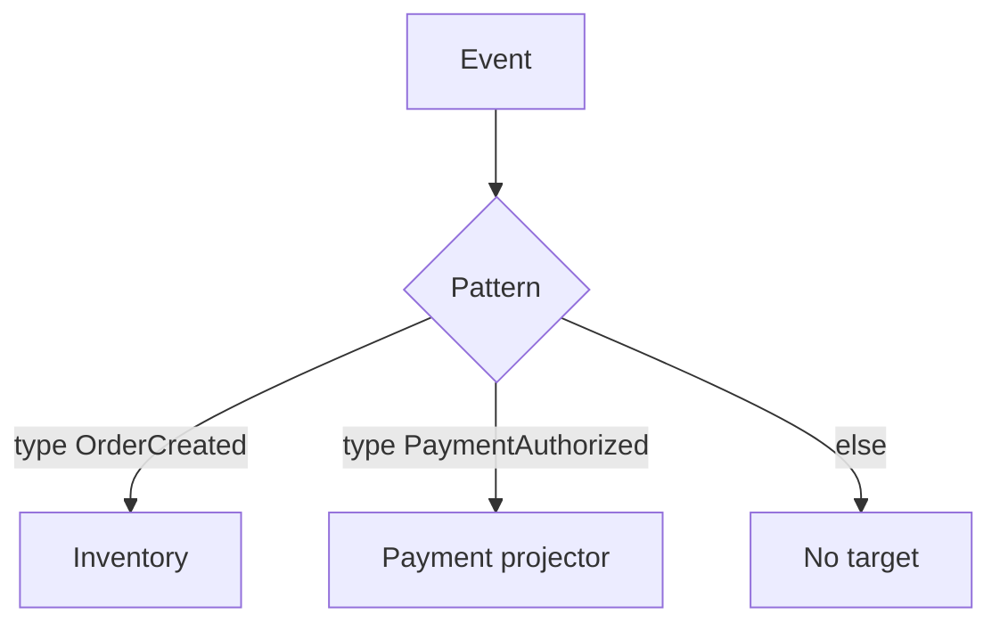

# Lesson 5.6 — Event Routing

**Module:** 05 — Event-Driven Architecture  
**Duration:** 25–35 minutes  
**BayLearn philosophy:** WHY → WHEN → HOW. Pattern first. Technology second.

---

## Learning outcomes

By the end of this lesson you will be able to:

1. Route on type and metadata first, payload second.
2. Keep rule sets reviewable.
3. Avoid routing that implements a hidden workflow engine.

---

## Enterprise scenario

Rules chained events into a de facto saga: Created → if paid then → if reserved then → email. Nobody could see the process. Routing should deliver facts, not hide a state machine.

> **Fiction notice:** Named companies in this course (Northbridge Bank, Harbor Retail, CareMesh Health, Atlas Manufacturing) are instructional fictions.

---

## WHY this exists

Routing matches predicates to targets. Good routing: type == OrderCreated → inventory queue. Bad routing: nested conditions that encode “if this then that unless Thursday.” When the path is a business process with compensations, use an orchestrator (Step Functions / saga) that is visible.

---

## WHEN an Enterprise Architect uses it

- Dispatch facts to the right consumers.
- Environment splitting (careful with prod data).
- Content-based subsetting (country, product line).

### When NOT to use it

- As a substitute for an orchestrator.
- Hundreds of overlapping rules with no test.

---

## HOW — the pattern (vendor-neutral)

Keep a routing table in git. Test patterns with sample events. Limit who can create rules in production. Prefer one rule per consumer need, named with the consumer’s name.

### Architecture diagram

---

## HOW — AWS implementation (after the pattern)

EventBridge rules and event patterns. Resource policies on buses. Lab 5 rules are explicit and listed in Terraform.

Do not start here. If you cannot explain the requirement and pattern without naming an AWS service, you are not ready to select technology.

---

## Anti-patterns

- Copy-paste rules with tiny differences and no tests.
- Rules that call a Lambda which then does all routing anyway.

---

## Tradeoffs

| Dimension | Benefit | Cost / risk |
|-----------|---------|-------------|
| Declarative rules | Fast wiring | Opaque processes if overused |
| Orchestrator | Visible process | More coupling to the workflow definition |

---

## Architecture decision prompt

A rule sends OrderCreated to payments only if amount > 0. Where should that invariant actually live?

Write four sentences: the requirement, the integration characteristics, the pattern, and why the rejected options fail the NFRs.

---

## Knowledge check

**Q1.** When do you stop adding rules and start a state machine?

*Answer.* When order of steps, compensation, and time-outs are business-critical rather than independent reactions.

---

## Architect's note

Capstone 2 will tempt you to hide the saga in rules. Do not.

---

## Next

Complete any architecture challenge attached to this lesson in the course player. Record an ADR fragment if the decision would survive a design review.
