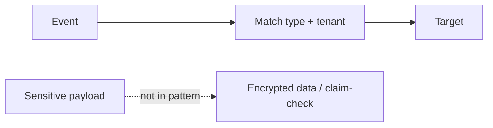

# Lesson 5.7 — Content-Based Filtering

**Module:** 05 — Event-Driven Architecture  
**Duration:** 25–35 minutes  
**BayLearn philosophy:** WHY → WHEN → HOW. Pattern first. Technology second.

---

## Learning outcomes

By the end of this lesson you will be able to:

1. Filter on declared attributes you control.
2. Minimize sensitive content in matchable fields.
3. Test filters as part of CI.

---

## Enterprise scenario

A healthcare bus filtered “if payload contains HIV.” That created a secondary disclosure risk in logs and rules. Content-based routing must respect data classification.

> **Fiction notice:** Named companies in this course (Northbridge Bank, Harbor Retail, CareMesh Health, Atlas Manufacturing) are instructional fictions.

---

## WHY this exists

Content-based filtering is powerful and dangerous. Match on coarse, non-sensitive attributes (eventType, orgId, severity). Do not put diagnoses, PANs, or secrets in rule patterns. For healthcare (Capstone 3), filters follow minimum necessary—often you route a pointer, not the clinical payload.

---

## WHEN an Enterprise Architect uses it

- High-volume buses where most consumers need a slice.
- Multi-tenant events with a tenant key.

### When NOT to use it

- Matching on raw clinical or payment PAN fields.
- Filters that require scanning huge payloads (cost and latency).

---

## HOW — the pattern (vendor-neutral)

Promote keys into the envelope. Encrypt the payload. Authorize consumers independently of filters. Review rules in security design.

### Architecture diagram

---

## HOW — AWS implementation (after the pattern)

EventBridge pattern matching on detail-type and detail fields. Prefer detail-type. Lab 5 can route on event type only; challenges may add amount bands with care.

Do not start here. If you cannot explain the requirement and pattern without naming an AWS service, you are not ready to select technology.

---

## Anti-patterns

- Logging the entire matching event including PHI.
- Filters as access control.

---

## Tradeoffs

| Dimension | Benefit | Cost / risk |
|-----------|---------|-------------|
| Rich payload matching | Flexible | Leakage and brittleness |
| Envelope matching | Safer, faster | Must design attributes up front |

---

## Architecture decision prompt

Should a rule match on patient.mrn? What is the least-privilege alternative?

Write four sentences: the requirement, the integration characteristics, the pattern, and why the rejected options fail the NFRs.

---

## Knowledge check

**Q1.** Why promote tenantId to the envelope?

*Answer.* So routing and IAM can use it without parsing or logging sensitive payload fields.

---

## Architect's note

Security architects should review event patterns the same way they review API paths.

---

## Next

Complete any architecture challenge attached to this lesson in the course player. Record an ADR fragment if the decision would survive a design review.
