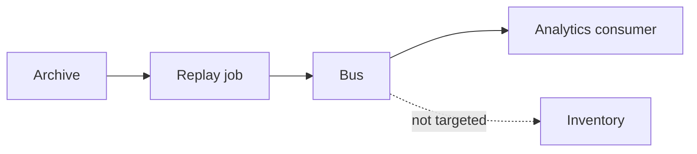

# Lesson 5.8 — Event Replay

**Module:** 05 — Event-Driven Architecture  
**Duration:** 25–35 minutes  
**BayLearn philosophy:** WHY → WHEN → HOW. Pattern first. Technology second.

---

## Learning outcomes

By the end of this lesson you will be able to:

1. Replay as a deliberate, auditable operation.
2. Make consumers idempotent before you replay.
3. Bound the time range and event types.

---

## Enterprise scenario

Someone replayed six months of OrderCreated to “fix analytics.” Inventory reserved again. Replay without consumer readiness is a self-inflicted incident.

> **Fiction notice:** Named companies in this course (Northbridge Bank, Harbor Retail, CareMesh Health, Atlas Manufacturing) are instructional fictions.

---

## WHY this exists

Replay exists because consumers bug, projections corrupt, or new consumers need history. It requires an archive, a time window, type filters, a target, and a communication plan. Consumers must be effectively-once. Some events must never be naively replayed (physical shipments already sent)—those consumers must no-op on old facts or you replay only to analytics.

---

## WHEN an Enterprise Architect uses it

- Rebuilding a projection.
- After a poison-bug fix.
- Onboarding a new read model.

### When NOT to use it

- As a substitute for a DLQ inspect/fix of a handful of poisons.
- Against consumers with non-idempotent real-world side effects.

---

## HOW — the pattern (vendor-neutral)

Archive facts. Document replay runbooks. Use a replay flag or separate replay bus if side-effecting consumers must be excluded. Record who replayed what in the audit log.

### Architecture diagram

---

## HOW — AWS implementation (after the pattern)

EventBridge archive + replay. S3 + redrive for files. SQS replay from DLQ is different (commands). Do not confuse them.

Do not start here. If you cannot explain the requirement and pattern without naming an AWS service, you are not ready to select technology.

---

## Anti-patterns

- Replay to the production topic with all subscribers live “to keep it real.”
- No audit of who replayed.

---

## Tradeoffs

| Dimension | Benefit | Cost / risk |
|-----------|---------|-------------|
| Archive everything | Forensic power | Cost and retention law |
| No archive | Cheap | Cannot rebuild or investigate |

---

## Architecture decision prompt

You need analytics to catch up but inventory must not. How do you target the replay?

Write four sentences: the requirement, the integration characteristics, the pattern, and why the rejected options fail the NFRs.

---

## Knowledge check

**Q1.** What must be true before a production replay?

*Answer.* Idempotent target consumers, a bounded query, an owner, and a plan for side-effecting subscribers.

---

## Architect's note

Capstones require a replay story. Write it before go-live, not during the outage.

---

## Next

Complete any architecture challenge attached to this lesson in the course player. Record an ADR fragment if the decision would survive a design review.
