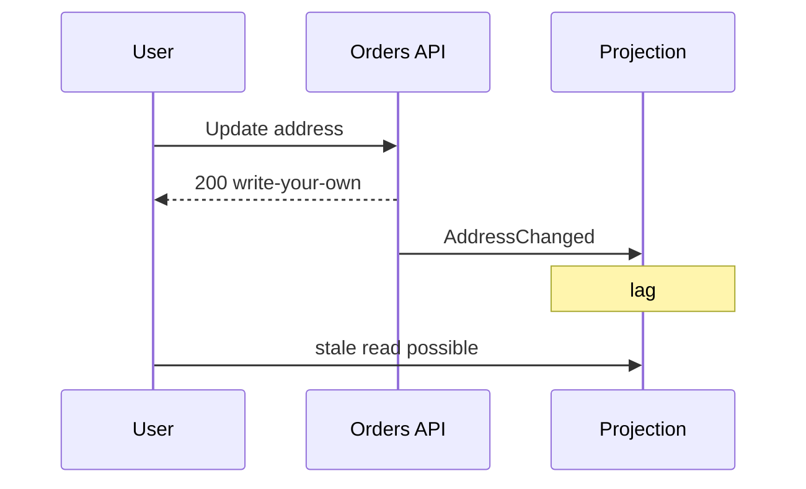

# Lesson 5.9 — Eventual Consistency

**Module:** 05 — Event-Driven Architecture  
**Duration:** 25–35 minutes  
**BayLearn philosophy:** WHY → WHEN → HOW. Pattern first. Technology second.

---

## Learning outcomes

By the end of this lesson you will be able to:

1. Set user and operator expectations for lag.
2. Design read APIs that do not lie about freshness.
3. Use compensating UX (refresh, status) instead of distributed locks by default.

---

## Enterprise scenario

Customer paid; UI still showed “unpaid” for 8 seconds. Support refunded. The architecture was correct; the UX and support playbook were not. Eventual consistency is a product problem.

> **Fiction notice:** Named companies in this course (Northbridge Bank, Harbor Retail, CareMesh Health, Atlas Manufacturing) are instructional fictions.

---

## WHY this exists

EDA accepts that views catch up. Architects must quantify lag SLOs, show status resources, and train support. Read-after-write can be preserved on the producer’s API (read your own write) while other systems lag. Do not promise a globally consistent dashboard across 12 projections without a design.

---

## WHEN an Enterprise Architect uses it

- Independent projections.
- Cross-enterprise facts.
- Any fan-out.

### When NOT to use it

- Hard legal constraints that two ledgers must match in the same commit (then you need a different pattern or a single ledger).

---

## HOW — the pattern (vendor-neutral)

Producer reads remain consistent. Downstream UIs display “updating…” or poll status. Business metrics track lag. Reconciliation jobs catch permanent divergence. Sagas handle business-level undo (Module 10).

### Architecture diagram

---

## HOW — AWS implementation (after the pattern)

DynamoDB reads on the orders table vs a projection table. CloudWatch lag metrics from consumer checkpoints. Do not use strongly consistent reads on a projection that is fed asynchronously and then claim the platform is strongly consistent.

Do not start here. If you cannot explain the requirement and pattern without naming an AWS service, you are not ready to select technology.

---

## Anti-patterns

- Support tools reading the slowest projection.
- No lag SLO.

---

## Tradeoffs

| Dimension | Benefit | Cost / risk |
|-----------|---------|-------------|
| EDA | Availability and decoupling | Lag and reconciliation |
| Single sync write to all | Simple reads | Coupled outages |

---

## Architecture decision prompt

The call center agent asks whether the address update “went through.” Which API is allowed to answer authoritatively?

Write four sentences: the requirement, the integration characteristics, the pattern, and why the rejected options fail the NFRs.

---

## Knowledge check

**Q1.** Where is read-your-write most easily guaranteed?

*Answer.* On the system of record’s own API after its durable write—not on a random projection.

---

## Architect's note

Write the support one-liner: “Source of truth is X; Y updates within N seconds.”

---

## Next

Complete any architecture challenge attached to this lesson in the course player. Record an ADR fragment if the decision would survive a design review.
