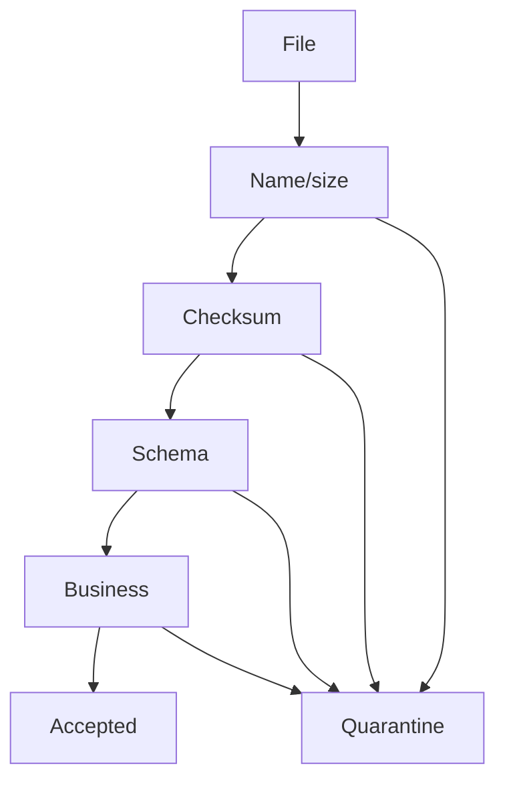

# Lesson 6.10 — File Validation

**Module:** 06 — Enterprise File Transfer  
**Duration:** 25–35 minutes  
**BayLearn philosophy:** WHY → WHEN → HOW. Pattern first. Technology second.

---

## Learning outcomes

By the end of this lesson you will be able to:

1. Layer validation from cheap to expensive.
2. Define quarantine outcomes.
3. Choose all-or-nothing vs partial.

---

## Enterprise scenario

A CSV with the right name contained HTML. The processor crashed in production. Validation is a gate, not a courtesy.

> **Fiction notice:** Named companies in this course (Northbridge Bank, Harbor Retail, CareMesh Health, Atlas Manufacturing) are instructional fictions.

---

## WHY this exists

Validation: antivirus/malware where required, format, schema, row counts, referential checks, and business thresholds. Fail to quarantine with reasons. Do not partially post a payment file without a defined policy (all-or-nothing vs partial with report).

---

## WHEN an Enterprise Architect uses it

- Every inbound file from outside a trust boundary.
- After internal extracts too if you do not trust the producer.

### When NOT to use it

- Validating only in Excel after posting.
- Letting a 50 GB file fully load into memory to “validate.”

---

## HOW — the pattern (vendor-neutral)

Layer: (1) size/name/MIME, (2) integrity checksum, (3) schema sample or full parse streaming, (4) business rules. Emit FileQuarantined vs FileAccepted. Human or partner notification.

### Architecture diagram

---

## HOW — AWS implementation (after the pattern)

Lambda streaming CSV (careful with size—use chunking or ECS). ClamAV patterns on ECS if malware scanning is in scope. Lab 6 implements schema + duplicate + checksum gates.

Do not start here. If you cannot explain the requirement and pattern without naming an AWS service, you are not ready to select technology.

---

## Anti-patterns

- Deleting invalid files to keep buckets pretty.
- Full in-memory parse of huge files.

---

## Tradeoffs

| Dimension | Benefit | Cost / risk |
|-----------|---------|-------------|
| All-or-nothing | Cleaner ledger | One bad row delays all |
| Partial | Progress | Harder reconciliation |

---

## Architecture decision prompt

All-or-nothing vs partial accept: which does a payment file typically need, and why?

Write four sentences: the requirement, the integration characteristics, the pattern, and why the rejected options fail the NFRs.

---

## Knowledge check

**Q1.** Where do invalid files go?

*Answer.* Quarantine prefix + catalog status + notification—not silent delete.

---

## Architect's note

Quarantine is a product: partners need a reason code.

---

## Next

Complete any architecture challenge attached to this lesson in the course player. Record an ADR fragment if the decision would survive a design review.
