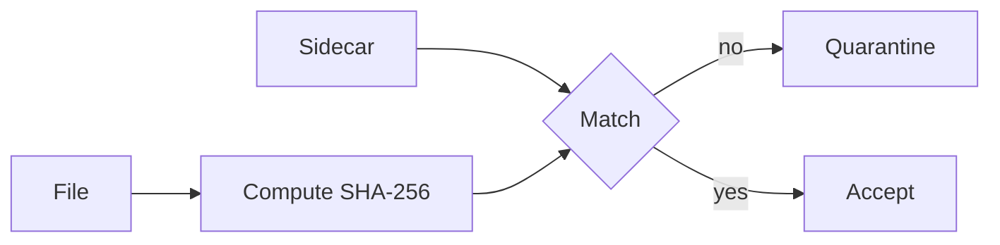

# Lesson 6.11 — Checksums

**Module:** 06 — Enterprise File Transfer  
**Duration:** 25–35 minutes  
**BayLearn philosophy:** WHY → WHEN → HOW. Pattern first. Technology second.

---

## Learning outcomes

By the end of this lesson you will be able to:

1. Use strong checksums as integrity evidence.
2. Do not confuse ETag with SHA-256.
3. Bind checksums to the catalog.

---

## Enterprise scenario

A truncated SFTP transfer posted as a complete payroll. Checksums are not optional in money files.

> **Fiction notice:** Named companies in this course (Northbridge Bank, Harbor Retail, CareMesh Health, Atlas Manufacturing) are instructional fictions.

---

## WHY this exists

Checksums (SHA-256 typically) prove integrity. Partners may send a sidecar .sha256 or a manifest. You compute on land and compare. ETags are not a cryptographic checksum (especially multipart). Record algorithm + value in the catalog.

---

## WHEN an Enterprise Architect uses it

- Any file where truncation or tamper matters.
- Legal/regulatory transfers.

### When NOT to use it

- Using Content-Length alone.
- MD5 as the only control in a high-threat model if you can do better.

---

## HOW — the pattern (vendor-neutral)

Contract: algorithm, sidecar or header, who computes. Worker streams hash. Mismatch → quarantine. Store checksum for duplicate detection too (same bytes twice).

### Architecture diagram

---

## HOW — AWS implementation (after the pattern)

Lambda/ECS compute hash; S3 checksum algorithms on upload when clients support them. Lab 6 compares sidecar vs computed.

Do not start here. If you cannot explain the requirement and pattern without naming an AWS service, you are not ready to select technology.

---

## Anti-patterns

- Checksum in the filename only.
- Skipping hash on “small” payment files.

---

## Tradeoffs

| Dimension | Benefit | Cost / risk |
|-----------|---------|-------------|
| Sidecar | Independent evidence | Partner capability |
| Platform-only hash | Always available | Does not detect partner-side truncation before send as well |

---

## Architecture decision prompt

Partner cannot send a sidecar. What compensating control do you require?

Write four sentences: the requirement, the integration characteristics, the pattern, and why the rejected options fail the NFRs.

---

## Knowledge check

**Q1.** Why is multipart ETag a poor integrity proof?

*Answer.* It is not a simple MD5 of the whole object; it is not a cryptographic signature of contents.

---

## Architect's note

Integrity is a security and a business control. Put it in the ADR.

---

## Next

Complete any architecture challenge attached to this lesson in the course player. Record an ADR fragment if the decision would survive a design review.
