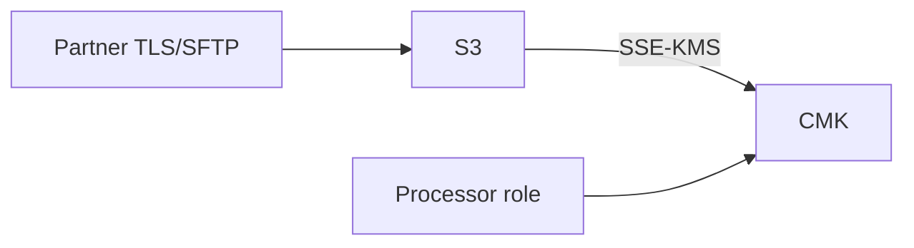

# Lesson 6.12 — Encryption

**Module:** 06 — Enterprise File Transfer  
**Duration:** 25–35 minutes  
**BayLearn philosophy:** WHY → WHEN → HOW. Pattern first. Technology second.

---

## Learning outcomes

By the end of this lesson you will be able to:

1. Mandate transit and rest encryption.
2. Use KMS as the control plane for file class.
3. Treat PGP as an adapter, not a platform.

---

## Enterprise scenario

A claims file at rest in an unencrypted bucket with a public-ish ACL is a reportable event waiting to happen.

> **Fiction notice:** Named companies in this course (Northbridge Bank, Harbor Retail, CareMesh Health, Atlas Manufacturing) are instructional fictions.

---

## WHY this exists

Encrypt in transit (SFTP/TLS) and at rest (KMS). Manage keys per classification. Restrict who can decrypt. Do not email passwords for zip files as your enterprise encryption strategy. Partner-side PGP still exists; treat it as an adapter.

---

## WHEN an Enterprise Architect uses it

- All sensitive files.
- Cross-account sharing with separate KMS policies.

### When NOT to use it

- Double encryption theater without key management.
- Client-side crypto that loses keys and the business with them—unless you have a designed key story.

---

## HOW — the pattern (vendor-neutral)

Default: TLS + SSE-KMS. Bucket keys. Separate CMKs for PCI vs general. Grants for processors. Rotate. CloudTrail on key use. If PGP is required, decrypt in a tight worker, never store plaintext in inbound.

### Architecture diagram

---

## HOW — AWS implementation (after the pattern)

KMS, S3 encryption, Transfer Family TLS. Secrets Manager for partner credentials. Lab 6 and 12 enforce this.

Do not start here. If you cannot explain the requirement and pattern without naming an AWS service, you are not ready to select technology.

---

## Anti-patterns

- SSE-S3 only when a regulator asked for customer-managed keys.
- Plain FTP “internal only.”

---

## Tradeoffs

| Dimension | Benefit | Cost / risk |
|-----------|---------|-------------|
| CMK per class | Blast radius | Key sprawl |
| One CMK | Simple | Over-broad decrypt |

---

## Architecture decision prompt

Who is allowed to kms:Decrypt the healthcare landing CMK, and why is that not the same as s3:GetObject on every bucket?

Write four sentences: the requirement, the integration characteristics, the pattern, and why the rejected options fail the NFRs.

---

## Knowledge check

**Q1.** Does HTTPS to a bucket make at-rest encryption unnecessary?

*Answer.* No. Transit and rest are different threats (path vs stolen disk/backup/mis-list).

---

## Architect's note

Encryption without IAM is incomplete. IAM without encryption is incomplete.

---

## Next

Complete any architecture challenge attached to this lesson in the course player. Record an ADR fragment if the decision would survive a design review.
