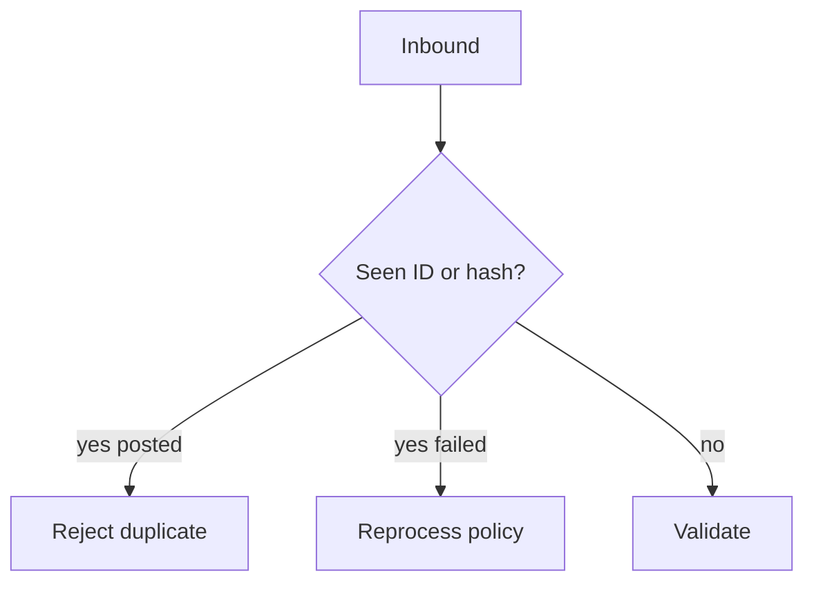

# Lesson 6.13 — Duplicate Detection

**Module:** 06 — Enterprise File Transfer  
**Duration:** 25–35 minutes  
**BayLearn philosophy:** WHY → WHEN → HOW. Pattern first. Technology second.

---

## Learning outcomes

By the end of this lesson you will be able to:

1. Treat duplicate files as a first-class case.
2. Key on business identity + checksum.
3. Never double-post.

---

## Enterprise scenario

The partner retried an SFTP PUT after a timeout. You posted payroll twice. Duplicates are the file equivalent of missing idempotency keys.

> **Fiction notice:** Named companies in this course (Northbridge Bank, Harbor Retail, CareMesh Health, Atlas Manufacturing) are instructional fictions.

---

## WHY this exists

Duplicates arrive because of retries, overlapping schedules, or copied files. Detect by checksum, by business natural key (file id in header), and by name. Policy: reject duplicate, or ignore if already posted, never double-post. Store seen hashes/IDs with TTL longer than the retry window (days to years in finance).

---

## WHEN an Enterprise Architect uses it

- Every inbound payment, payroll, claims, settlement file.
- Any partner known to retry.

### When NOT to use it

- Using only filename when names are reused daily.
- Hash-only when two legal files can be identical (rare but know it).

---

## HOW — the pattern (vendor-neutral)

Catalog unique constraint on (partner, businessDate, fileId) and/or checksum. First writer wins. Second gets DuplicateDetected event and partner notification. Replay of a failed file is not a duplicate if the first never posted—status matters.

### Architecture diagram

---

## HOW — AWS implementation (after the pattern)

DynamoDB conditional put. Lab 6 implements this. Chaos lab will drop a duplicate on purpose.

Do not start here. If you cannot explain the requirement and pattern without naming an AWS service, you are not ready to select technology.

---

## Anti-patterns

- Overwrite same S3 key and hoping versioning saves the ops story without a catalog.

---

## Tradeoffs

| Dimension | Benefit | Cost / risk |
|-----------|---------|-------------|
| Strict hash dedupe | Stops retries | Blocks legitimate identical extracts if that can happen |
| Business fileId | Intent-based | Partner must send IDs |

---

## Architecture decision prompt

File failed validation then is resent identically. Duplicate or reprocess? What status on the first record makes this safe?

Write four sentences: the requirement, the integration characteristics, the pattern, and why the rejected options fail the NFRs.

---

## Knowledge check

**Q1.** Is a retry after a quarantine a duplicate?

*Answer.* Only if the original was successfully posted. Failed files need a defined reprocess path.

---

## Architect's note

This is Lesson 2.11 for bytes. Same idea, different grain.

---

## Next

Complete any architecture challenge attached to this lesson in the course player. Record an ADR fragment if the decision would survive a design review.
