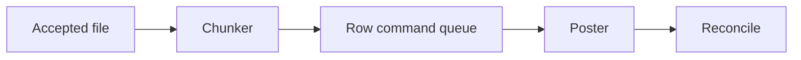

# Lesson 6.14 — File Processing

**Module:** 06 — Enterprise File Transfer  
**Duration:** 25–35 minutes  
**BayLearn philosophy:** WHY → WHEN → HOW. Pattern first. Technology second.

---

## Learning outcomes

By the end of this lesson you will be able to:

1. Process with checkpoints and row idempotency.
2. Apply back-pressure to downstream APIs.
3. Emit completion facts.

---

## Enterprise scenario

Accepted files still need posting, not just storage. Processing is a workflow with checkpoints.

> **Fiction notice:** Named companies in this course (Northbridge Bank, Harbor Retail, CareMesh Health, Atlas Manufacturing) are instructional fictions.

---

## WHY this exists

Processing transforms a valid file into business effects: rows to commands, aggregates to ledgers. Use streaming/chunking, checkpoint row numbers, and idempotent row keys. Prefer emitting per-row commands to a queue if downstream is TPS-limited (back-pressure).

---

## WHEN an Enterprise Architect uses it

- After accept.
- When mapping to domain APIs or ledgers.

### When NOT to use it

- Giant in-memory pandas on Lambda for 20 GB.
- Calling a sync API per row without rate limits.

---

## HOW — the pattern (vendor-neutral)

Step Functions or ECS job: read, chunk, send messages, wait, summarize, reconcile. Checkpoint in DynamoDB. Poison rows to a sidecar error file. Complete with FileProcessed event and metrics (rows ok/fail).

### Architecture diagram

---

## HOW — AWS implementation (after the pattern)

Step Functions + Lambda or Fargate. SQS between parse and post. Lab 6 uses a simplified Lambda processor; capstones should show checkpoints.

Do not start here. If you cannot explain the requirement and pattern without naming an AWS service, you are not ready to select technology.

---

## Anti-patterns

- No row identity.
- Processor with dynamodb:* and admin S3.

---

## Tradeoffs

| Dimension | Benefit | Cost / risk |
|-----------|---------|-------------|
| Row commands | Retry granularity | More messages |
| Monolithic job | Simple | Fail-all or complex resume |

---

## Architecture decision prompt

10 million rows at 50 TPS downstream: do you need a queue, and what is the wall-clock?

Write four sentences: the requirement, the integration characteristics, the pattern, and why the rejected options fail the NFRs.

---

## Knowledge check

**Q1.** What is a checkpoint?

*Answer.* Durable progress (byte or row) so a crash does not restart from zero or double-post.

---

## Architect's note

Processing is where file style meets message style. Composition is normal.

---

## Next

Complete any architecture challenge attached to this lesson in the course player. Record an ADR fragment if the decision would survive a design review.
