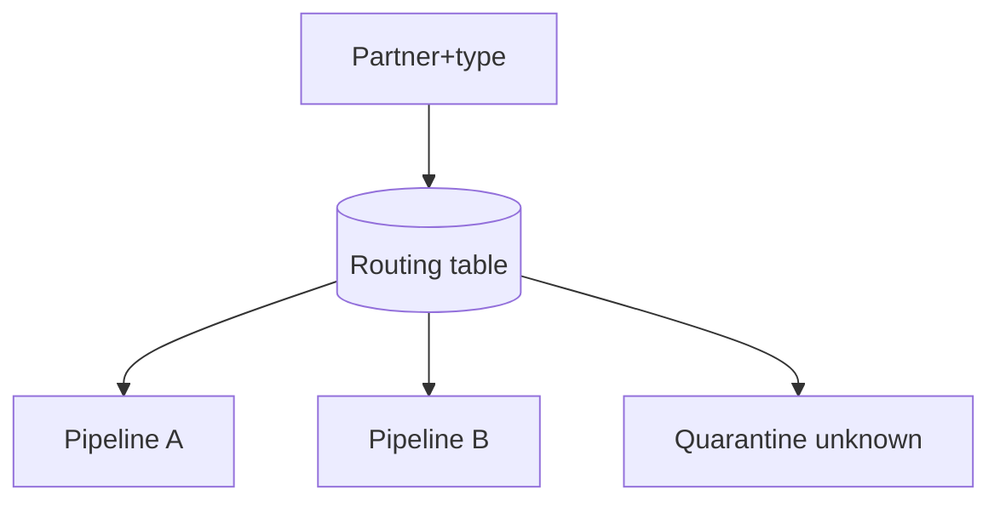

# Lesson 6.15 — File Routing

**Module:** 06 — Enterprise File Transfer  
**Duration:** 25–35 minutes  
**BayLearn philosophy:** WHY → WHEN → HOW. Pattern first. Technology second.

---

## Learning outcomes

By the end of this lesson you will be able to:

1. Route from metadata, not folklore.
2. Fail unknown routes to quarantine.
3. Keep routing data-driven.

---

## Enterprise scenario

Payments files must not enter the marketing bucket. Routing is content + partner + type, with security.

> **Fiction notice:** Named companies in this course (Northbridge Bank, Harbor Retail, CareMesh Health, Atlas Manufacturing) are instructional fictions.

---

## WHY this exists

Routing decides the processing pipeline: partner, file type, country, sensitivity. Implement as a table, not as twenty undocumented if-statements. Wrong routing is a data-leak incident.

---

## WHEN an Enterprise Architect uses it

- Multi-partner landing zones.
- Multiple downstream products.

### When NOT to use it

- Routing on payload PII in logs.
- Hard-coded partner names in Lambda without a table.

---

## HOW — the pattern (vendor-neutral)

Config: partner + type → pipeline, schema, destination, pageable owners. Unknown combination → quarantine, not a default “misc” processor that posts money.

### Architecture diagram

---

## HOW — AWS implementation (after the pattern)

DynamoDB routing table, EventBridge rules on metadata, Step Functions choice. Lab 6 uses a small map in config; capstones need a table.

Do not start here. If you cannot explain the requirement and pattern without naming an AWS service, you are not ready to select technology.

---

## Anti-patterns

- Default route to production ledger.
- Routing rules only in someone’s head.

---

## Tradeoffs

| Dimension | Benefit | Cost / risk |
|-----------|---------|-------------|
| Table-driven | Onboard without deploys | Need governance of the table |
| Code-if | Obvious in git | Every partner is a release |

---

## Architecture decision prompt

A new partner is onboarded. Should that require a code deploy? What would a self-serve MFT do instead?

Write four sentences: the requirement, the integration characteristics, the pattern, and why the rejected options fail the NFRs.

---

## Knowledge check

**Q1.** What should happen to an unknown partner/type pair?

*Answer.* Quarantine and alert—not a default poster.

---

## Architect's note

Self-serve onboarding is a routing-table product plus identity, not a new Lambda per partner.

---

## Next

Complete any architecture challenge attached to this lesson in the course player. Record an ADR fragment if the decision would survive a design review.
