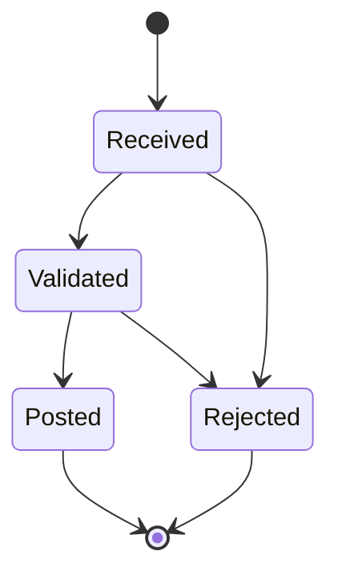

# Lesson 6.16 — File Acknowledgements

**Module:** 06 — Enterprise File Transfer  
**Duration:** 25–35 minutes  
**BayLearn philosophy:** WHY → WHEN → HOW. Pattern first. Technology second.

---

## Learning outcomes

By the end of this lesson you will be able to:

1. Separate received vs posted acks.
2. Offer machine-readable status.
3. Avoid premature success.

---

## Enterprise scenario

Partners ask “did you get it?” If the only answer is a help desk ticket, you designed a call center, not a platform.

> **Fiction notice:** Named companies in this course (Northbridge Bank, Harbor Retail, CareMesh Health, Atlas Manufacturing) are instructional fictions.

---

## WHY this exists

Acknowledgements (MDN, .ack files, webhooks, status APIs) close the loop. They are a contract: received, accepted, rejected, posted. They should include correlation IDs and reason codes. Do not ack “posted” at SFTP RECEIVE time.

---

## WHEN an Enterprise Architect uses it

- Any SLA with a partner.
- When finance reconciles against your receipt.

### When NOT to use it

- Ack success at protocol receive before validation.
- Ack via an unsigned email from a personal inbox.

---

## HOW — the pattern (vendor-neutral)

States: Received → Validated → Posted / Rejected. Emit each as event and as partner-visible status. Optional outbound ACK file on SFTP. Status API for portals and agents (Module 15).

### Architecture diagram

---

## HOW — AWS implementation (after the pattern)

DynamoDB status, SNS to partner webhook, outbound Transfer connector or S3 drop. Lab 6 notifies via SNS email/SMS-less email placeholder and catalog status.

Do not start here. If you cannot explain the requirement and pattern without naming an AWS service, you are not ready to select technology.

---

## Anti-patterns

- Always-200 webhook.
- ACK file that overwrites and loses history.

---

## Tradeoffs

| Dimension | Benefit | Cost / risk |
|-----------|---------|-------------|
| Rich ACK | Fewer tickets | Must keep status honest |
| No ACK | Less work | Operational noise |

---

## Architecture decision prompt

At which state would you tell a bank “safe to consider it received for SLA” vs “safe to consider it settled”?

Write four sentences: the requirement, the integration characteristics, the pattern, and why the rejected options fail the NFRs.

---

## Knowledge check

**Q1.** Why not ack posted at SFTP success?

*Answer.* Bytes landed, but validation and ledger posting have not occurred. You would lie.

---

## Architect's note

The ops agent’s “did it arrive?” is this catalog. Build it now.

---

## Next

Complete any architecture challenge attached to this lesson in the course player. Record an ADR fragment if the decision would survive a design review.
