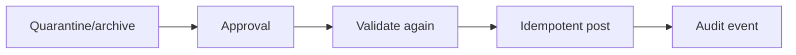

# Lesson 6.17 — File Reprocessing

**Module:** 06 — Enterprise File Transfer  
**Duration:** 25–35 minutes  
**BayLearn philosophy:** WHY → WHEN → HOW. Pattern first. Technology second.

---

## Learning outcomes

By the end of this lesson you will be able to:

1. Make reprocess auditable and idempotent.
2. Require authorization commensurate with risk.
3. Link new runs to original files.

---

## Enterprise scenario

A schema bug rejected a good file. After the fix, reprocessing must be authorized, auditable, and idempotent.

> **Fiction notice:** Named companies in this course (Northbridge Bank, Harbor Retail, CareMesh Health, Atlas Manufacturing) are instructional fictions.

---

## WHY this exists

Reprocess is a controlled write: copy from archive/quarantine, new correlation ID linked to original, same duplicate rules against *posted* outcomes. It is a favorite agent action—and therefore must be HITL in Module 15. Not every user may reprocess payments.

---

## WHEN an Enterprise Architect uses it

- After a platform bug.
- After a partner resent is not possible.

### When NOT to use it

- Unattended infinite reprocess loops.
- Reprocess that bypasses validation “because we know it is fine.”

---

## HOW — the pattern (vendor-neutral)

Runbook: identify file version, reason, approver, new run ID, validate again, post idempotently, audit event FileReprocessed. Store who approved. Capstone 1 requires this.

### Architecture diagram

---

## HOW — AWS implementation (after the pattern)

Step Functions with an approval task (or a DynamoDB approval record the agent writes). IAM so only a role can start reprocess. Lab 6 includes a replay path analogous to SQS DLQ replay.

Do not start here. If you cannot explain the requirement and pattern without naming an AWS service, you are not ready to select technology.

---

## Anti-patterns

- Reprocess as a raw S3 copy into inbound with no audit.
- Same correlation ID masking that a second run occurred.

---

## Tradeoffs

| Dimension | Benefit | Cost / risk |
|-----------|---------|-------------|
| HITL reprocess | Safer | Slower recovery |
| One-click replay | Fast | Easy fraud/mistake |

---

## Architecture decision prompt

Should a customer-support agent be able to reprocess a 20 GB settlement without a second approver?

Write four sentences: the requirement, the integration characteristics, the pattern, and why the rejected options fail the NFRs.

---

## Knowledge check

**Q1.** What must not change on reprocess?

*Answer.* The business identity of the file; duplicate detection against successful posts still applies.

---

## Architect's note

Write actions for agents start here. Design the approval now.

---

## Next

Complete any architecture challenge attached to this lesson in the course player. Record an ADR fragment if the decision would survive a design review.
