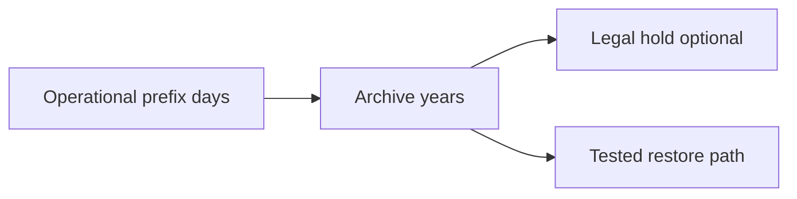

# Lesson 6.18 — File Archival

**Module:** 06 — Enterprise File Transfer  
**Duration:** 25–35 minutes  
**BayLearn philosophy:** WHY → WHEN → HOW. Pattern first. Technology second.

---

## Learning outcomes

By the end of this lesson you will be able to:

1. Design retention by data class.
2. Separate ops store from legal archive.
3. Test restore.

---

## Enterprise scenario

A regulator asks for the file from 17 months ago. If lifecycle deleted it, you have a legal problem, not a storage problem.

> **Fiction notice:** Named companies in this course (Northbridge Bank, Harbor Retail, CareMesh Health, Atlas Manufacturing) are instructional fictions.

---

## WHY this exists

Archive is a retention design: how long, which storage class, legal hold, who can read, encryption, and retrieval SLA. Operational prefixes should not be your 7-year store. Move posted files to archive with metadata intact. Prove immutability if required (WORM).

---

## WHEN an Enterprise Architect uses it

- Regulated files.
- Forensic replay needs.
- Cost reduction after the operational window.

### When NOT to use it

- Archive as the only copy while processing is live.
- Infinite retention of everything including malware samples without a policy.

---

## HOW — the pattern (vendor-neutral)

Policy table: data class → retention → storage class → legal hold. Lifecycle rules. Separate account for archives if threat model requires. Test a restore once a quarter.

### Architecture diagram

---

## HOW — AWS implementation (after the pattern)

S3 lifecycle to IA/Glacier, Object Lock where needed, Vault Lock patterns, cross-account. Cost in the ADR. Lab 6 uses a short lifecycle so student accounts do not store forever—**document that production would differ**.

Do not start here. If you cannot explain the requirement and pattern without naming an AWS service, you are not ready to select technology.

---

## Anti-patterns

- Deleting inbound to save cost before archive copy confirms.
- Archive bucket world-readable.

---

## Tradeoffs

| Dimension | Benefit | Cost / risk |
|-----------|---------|-------------|
| Cold archive | Cost | Retrieval time |
| Hot forever | Fast replay | Cost and exposure |

---

## Architecture decision prompt

If Glacier restore is 12 hours and the SLA to reprocess is 1 hour, is Glacier the right operational archive?

Write four sentences: the requirement, the integration characteristics, the pattern, and why the rejected options fail the NFRs.

---

## Knowledge check

**Q1.** Why not use the lab’s 1-day lifecycle in production?

*Answer.* Labs optimize cost. Production retention is a legal NFR and belongs in the ADR.

---

## Architect's note

Retention is an architecture decision with counsel, not a lifecycle checkbox copied from a blog.

---

## Next

Complete any architecture challenge attached to this lesson in the course player. Record an ADR fragment if the decision would survive a design review.
