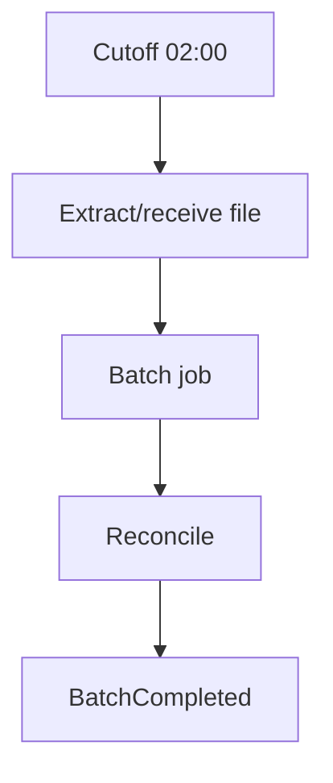

# Lesson 6.2 — Batch Integration

**Module:** 06 — Enterprise File Transfer  
**Duration:** 25–35 minutes  
**BayLearn philosophy:** WHY → WHEN → HOW. Pattern first. Technology second.

---

## Learning outcomes

By the end of this lesson you will be able to:

1. Define batch as a rhythm with cutoff and rerun.
2. Combine batch edge with evented internals.
3. State reconciliation as part of the batch contract.

---

## Enterprise scenario

Northbridge posts interest in a nightly batch. Intraday APIs still exist for balances. Both are correct at different grains.

> **Fiction notice:** Named companies in this course (Northbridge Bank, Harbor Retail, CareMesh Health, Atlas Manufacturing) are instructional fictions.

---

## WHY this exists

Batch is an integration rhythm: accumulate, cut a file or job, process, reconcile. It optimizes for throughput and simplicity of recovery (rerun the file) at the cost of latency. Mixed estates use batch at the edge and events inside the day.

---

## WHEN an Enterprise Architect uses it

- End-of-day, payroll, clearing, analytics extracts.
- When reconciliation of a set is the business event.

### When NOT to use it

- When the customer is waiting at a spinner for the batch.
- When a 24h delay violates a 300 ms NFR.

---

## HOW — the pattern (vendor-neutral)

Define the business date, cutoff, SLA to finish, and rerun policy. Idempotent batch jobs. Do not overlap two business dates without a design. Publish BatchCompleted as an event for downstreams.

### Architecture diagram

---

## HOW — AWS implementation (after the pattern)

S3 + EventBridge schedule or Transfer arrival; Step Functions for the job; Glue if it is data-platform heavy (not this course’s center). Keep operational batches in Step Functions + Lambda unless volume demands otherwise.

Do not start here. If you cannot explain the requirement and pattern without naming an AWS service, you are not ready to select technology.

---

## Anti-patterns

- No cutoff, files arrive all day with the same name.
- Rerun that double-posts.

---

## Tradeoffs

| Dimension | Benefit | Cost / risk |
|-----------|---------|-------------|
| Batch | Simple recovery, high throughput | Latency and cutoff politics |

---

## Architecture decision prompt

Can an intraday API and a nightly file share a ledger without double posting? What key prevents it?

Write four sentences: the requirement, the integration characteristics, the pattern, and why the rejected options fail the NFRs.

---

## Knowledge check

**Q1.** What is a cutoff?

*Answer.* The business clock time after which records belong to the next file/date.

---

## Architect's note

Always name the business date in the file contract.

---

## Next

Complete any architecture challenge attached to this lesson in the course player. Record an ADR fragment if the decision would survive a design review.
