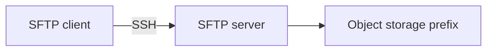

# Lesson 6.3 — SFTP

**Module:** 06 — Enterprise File Transfer  
**Duration:** 25–35 minutes  
**BayLearn philosophy:** WHY → WHEN → HOW. Pattern first. Technology second.

---

## Learning outcomes

By the end of this lesson you will be able to:

1. Position SFTP as an edge protocol.
2. List baseline security controls.
3. Separate protocol from processing.

---

## Enterprise scenario

A hospital’s LIS can only push via SFTP with a password they refuse to rotate. You still have to land labs. SFTP is a constraint, not a preference.

> **Fiction notice:** Named companies in this course (Northbridge Bank, Harbor Retail, CareMesh Health, Atlas Manufacturing) are instructional fictions.

---

## WHY this exists

SFTP (SSH File Transfer Protocol) is the dominant partner file protocol. It provides encrypted-in-transit transfer, user isolation, and operational familiarity. It does not provide a business workflow, schema validation, or exactly-once processing. Those are your platform’s job once the bytes land.

---

## WHEN an Enterprise Architect uses it

- Partners mandate SFTP.
- You need a pull or push file path across enterprises.

### When NOT to use it

- Internal microservice hops (use APIs/events).
- Unencrypted FTP in 2026 without a documented waiver and compensating controls.

---

## HOW — the pattern (vendor-neutral)

Standardize user provisioning, key (not password) auth, chrooted directories, IP allow lists, and banner/legal. Separate inbound and outbound trees. Never share one user across two partners.

### Architecture diagram

---

## HOW — AWS implementation (after the pattern)

AWS Transfer Family provides managed SFTP in front of S3. You still design IAM scopes so partner A cannot list partner B. Lab 6 uses this edge.

Do not start here. If you cannot explain the requirement and pattern without naming an AWS service, you are not ready to select technology.

---

## Anti-patterns

- Shared SFTP user “partners”.
- Landing in a Windows share with no checksum.

---

## Tradeoffs

| Dimension | Benefit | Cost / risk |
|-----------|---------|-------------|
| SFTP | Universal partner skill | User lifecycle and always-on endpoint cost |

---

## Architecture decision prompt

Password vs SSH key: which belongs in Secrets Manager/KMS and which belongs in a human process?

Write four sentences: the requirement, the integration characteristics, the pattern, and why the rejected options fail the NFRs.

---

## Knowledge check

**Q1.** Does SFTP validate a CSV schema?

*Answer.* No. It moves bytes. Validation is a downstream platform concern.

---

## Architect's note

SFTP success is “object exists with integrity,” not “business posting succeeded.”

---

## Next

Complete any architecture challenge attached to this lesson in the course player. Record an ADR fragment if the decision would survive a design review.
