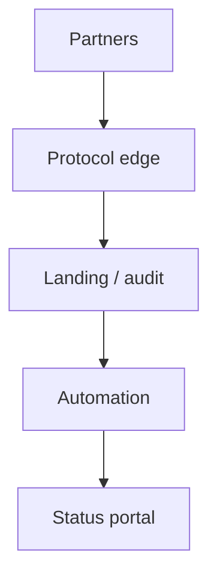

# Lesson 6.4 — Managed File Transfer

**Module:** 06 — Enterprise File Transfer  
**Duration:** 25–35 minutes  
**BayLearn philosophy:** WHY → WHEN → HOW. Pattern first. Technology second.

---

## Learning outcomes

By the end of this lesson you will be able to:

1. Define MFT beyond SFTP.
2. List capabilities an architect must cover.
3. Avoid appliance-shaped thinking in cloud.

---

## Enterprise scenario

Harbor’s MFT appliance is out of support. The desire is self-serve partner onboarding, audit, and automation—not another box.

> **Fiction notice:** Named companies in this course (Northbridge Bank, Harbor Retail, CareMesh Health, Atlas Manufacturing) are instructional fictions.

---

## WHY this exists

Managed File Transfer (MFT) is a product category: protocol endpoints, partner identities, scheduling, non-repudiation, ops UI. Cloud MFT should keep those controls and add landing-zone automation. If you only stand up SFTP you have a server, not MFT.

---

## WHEN an Enterprise Architect uses it

- Many partners, audits, SLAs, dual-run with legacy MFT.
- When business users must see file status without SSH.

### When NOT to use it

- A single file from one team this quarter—maybe a secured bucket is enough, with an expiry date.

---

## HOW — the pattern (vendor-neutral)

Capabilities: identity, protocol, routing, encryption, checksums, notifications, audit, self-serve catalog. Map each to platform components. Do not buy an appliance to hide a missing operating model.

### Architecture diagram

---

## HOW — AWS implementation (after the pattern)

Transfer Family + S3 + EventBridge + Step Functions + DynamoDB catalog + Cognito portal is a cloud MFT pattern (see BayLearn file-transfer course). This course treats it as one style among six.

Do not start here. If you cannot explain the requirement and pattern without naming an AWS service, you are not ready to select technology.

---

## Anti-patterns

- Lift-and-shift the appliance VM and calling it modernization.

---

## Tradeoffs

| Dimension | Benefit | Cost / risk |
|-----------|---------|-------------|
| Full MFT platform | Ops and audit | Build cost |
| Bare SFTP | Fast | Scripts and heroics |

---

## Architecture decision prompt

Which MFT capabilities are “protocol” vs “integration platform” vs “portal”?

Write four sentences: the requirement, the integration characteristics, the pattern, and why the rejected options fail the NFRs.

---

## Knowledge check

**Q1.** Name three MFT capabilities SFTP alone does not give you.

*Answer.* Schema validation, business routing, SLA dashboards (among others).

---

## Architect's note

If nobody can answer “did the file arrive?” without SSH, you do not have MFT.

---

## Next

Complete any architecture challenge attached to this lesson in the course player. Record an ADR fragment if the decision would survive a design review.
