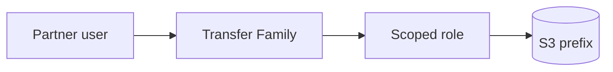

# Lesson 6.5 — AWS Transfer Family

**Module:** 06 — Enterprise File Transfer  
**Duration:** 25–35 minutes  
**BayLearn philosophy:** WHY → WHEN → HOW. Pattern first. Technology second.

---

## Learning outcomes

By the end of this lesson you will be able to:

1. Map Transfer Family to the SFTP edge pattern.
2. State cost and security controls.
3. Refuse to put domain logic in the protocol service.

---

## Enterprise scenario

Lab 6’s edge. You must know what you are paying for by the hour.

> **Fiction notice:** Named companies in this course (Northbridge Bank, Harbor Retail, CareMesh Health, Atlas Manufacturing) are instructional fictions.

---

## WHY this exists

Transfer Family is a managed protocol endpoint (SFTP/FTPS/FTP/AS2) that stores objects in S3 or EFS. It is the AWS implementation of the SFTP edge—not the whole architecture. Cost is dominated by the **online endpoint hours**, so labs must stop or destroy it.

---

## WHEN an Enterprise Architect uses it

- You need managed SFTP without babysitting an EC2 OpenSSH box.
- You want IAM-mapped access to prefixes.

### When NOT to use it

- High-volume internal copies that never leave AWS (use S3 APIs).
- As a place to run business logic.

---

## HOW — the pattern (vendor-neutral)

Design: per-partner users, scoped IAM home directories, encryption, logging to CloudWatch, no public exposure beyond need, keys not passwords. Workflows can trigger on upload but still keep business logic in your processors.

### Architecture diagram

---

## HOW — AWS implementation (after the pattern)

AWS Transfer Family server, service-managed users or IdP, S3 backend, optional connectors for outbound. Lab 6 Terraform enables a server you must destroy. Estimated cost is in the lab workbook.

Do not start here. If you cannot explain the requirement and pattern without naming an AWS service, you are not ready to select technology.

---

## Anti-patterns

- One IAM role that can read the entire bucket.
- FTP enabled “for testing” in prod.

---

## Tradeoffs

| Dimension | Benefit | Cost / risk |
|-----------|---------|-------------|
| Managed SFTP | Less patching | Hourly cost while ONLINE |

---

## Architecture decision prompt

Why is leaving Transfer Family running over a weekend a cost incident rather than a convenience?

Write four sentences: the requirement, the integration characteristics, the pattern, and why the rejected options fail the NFRs.

---

## Knowledge check

**Q1.** What is the primary ongoing cost driver?

*Answer.* The Transfer Family server endpoint hours while ONLINE.

---

## Architect's note

Cleanup is part of the architecture. Cost is an NFR.

---

## Next

Complete any architecture challenge attached to this lesson in the course player. Record an ADR fragment if the decision would survive a design review.
