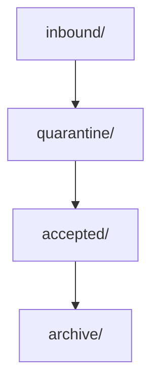

# Lesson 6.6 — Amazon S3

**Module:** 06 — Enterprise File Transfer  
**Duration:** 25–35 minutes  
**BayLearn philosophy:** WHY → WHEN → HOW. Pattern first. Technology second.

---

## Learning outcomes

By the end of this lesson you will be able to:

1. Use S3 as a landing-zone system of record.
2. Design prefixes as contracts.
3. Enable versioning and events.

---

## Enterprise scenario

S3 is the system of record for landed files, not a random folder.

> **Fiction notice:** Named companies in this course (Northbridge Bank, Harbor Retail, CareMesh Health, Atlas Manufacturing) are instructional fictions.

---

## WHY this exists

Object storage gives durability, versioning, lifecycle, encryption, eventing, and prefix isolation. Treat prefixes as **contracts**: inbound, quarantine, accepted, archive. Bucket design is security design (partner isolation).

---

## WHEN an Enterprise Architect uses it

- Landing, staging, archive, large payloads, claim-check.
- Any file style on AWS.

### When NOT to use it

- As a database for single-row queries.
- As a queue (it is not exactly-once work orchestration).

---

## HOW — the pattern (vendor-neutral)

Versioning on. Block public access. KMS. Separate buckets or strong prefixes per class of data. Events on ObjectCreated for automation. Lifecycle to cheaper storage after the operational window. Object Lock if legal hold requires it.

### Architecture diagram

---

## HOW — AWS implementation (after the pattern)

S3 + EventBridge notifications (or S3 fan-out). Bucket keys for KMS cost. Lab 6 uses inbound/quarantine/archive prefixes.

Do not start here. If you cannot explain the requirement and pattern without naming an AWS service, you are not ready to select technology.

---

## Anti-patterns

- Public ACL “just for a test file.”
- Same prefix for inbound and archive.

---

## Tradeoffs

| Dimension | Benefit | Cost / risk |
|-----------|---------|-------------|
| Shared bucket + prefixes | Fewer buckets | IAM complexity |
| Bucket per partner | Hard isolation | Quota and ops sprawl |

---

## Architecture decision prompt

Partner A and B share a bucket. What IAM condition prevents A from reading B, and what prefix standard do you need?

Write four sentences: the requirement, the integration characteristics, the pattern, and why the rejected options fail the NFRs.

---

## Knowledge check

**Q1.** Why versioning?

*Answer.* So overwrite or delete does not destroy evidence; reprocessing can use a specific version ID.

---

## Architect's note

If you cannot point to the object version of a payment file, you cannot survive an audit.

---

## Next

Complete any architecture challenge attached to this lesson in the course player. Record an ADR fragment if the decision would survive a design review.
