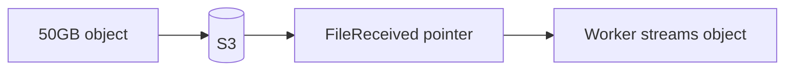

# Lesson 6.7 — Large Files

**Module:** 06 — Enterprise File Transfer  
**Duration:** 25–35 minutes  
**BayLearn philosophy:** WHY → WHEN → HOW. Pattern first. Technology second.

---

## Learning outcomes

By the end of this lesson you will be able to:

1. Refuse illegal transports for large payloads.
2. Introduce claim-check.
3. Size workers to file reality.

---

## Enterprise scenario

A 12 GB image package will not pass API Gateway or SQS. Claim-check exists because physics exists.

> **Fiction notice:** Named companies in this course (Northbridge Bank, Harbor Retail, CareMesh Health, Atlas Manufacturing) are instructional fictions.

---

## WHY this exists

Large files stress timeouts, memory, cost, and virus scanning. They must land via multipart/SFTP/S3 APIs, then be processed by workers sized for the job (Lambda has size and time limits; Fargate/ECS may be required). Never put the bytes on the bus.

---

## WHEN an Enterprise Architect uses it

- Hundreds of MB to tens of GB+.
- Media, CAD, genomic, full-book extracts.

### When NOT to use it

- Hiding a 50 GB payload inside a “message.”
- Streaming the whole file through a 512 MB Lambda without a plan.

---

## HOW — the pattern (vendor-neutral)

Claim-check: message/event holds URI + checksum + size. Workers stream, do not buffer entirely if avoidable. Multipart upload. Checkpoints. Module 7 goes deep; here you learn to refuse the wrong style.

### Architecture diagram

---

## HOW — AWS implementation (after the pattern)

S3 multipart, Transfer Family, ECS for heavy CPU hashing if needed, Lambda for lightweight metadata. Lab 7 implements the API-init + direct S3 path.

Do not start here. If you cannot explain the requirement and pattern without naming an AWS service, you are not ready to select technology.

---

## Anti-patterns

- Base64 in JSON on SQS.
- Single PUT from a browser to API Gateway.

---

## Tradeoffs

| Dimension | Benefit | Cost / risk |
|-----------|---------|-------------|
| Direct-to-S3 | Physics-friendly | More client complexity |
| Proxy through API | Simple client | Hard limits and cost |

---

## Architecture decision prompt

Which of API Gateway, SQS, DynamoDB item, EventBridge put-events is acceptable as the primary transport for 25 GB?

Write four sentences: the requirement, the integration characteristics, the pattern, and why the rejected options fail the NFRs.

---

## Knowledge check

**Q1.** What travels on the event bus for a large file?

*Answer.* A pointer (bucket, key, version, checksum), not the bytes.

---

## Architect's note

The 25 GB challenge in Module 14 is this lesson as a multiple-choice trap.

---

## Next

Complete any architecture challenge attached to this lesson in the course player. Record an ADR fragment if the decision would survive a design review.
