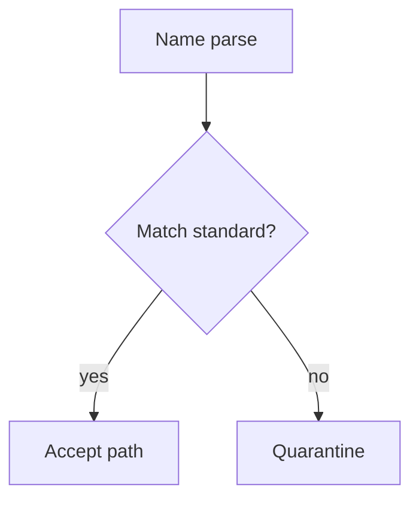

# Lesson 6.8 — File Naming Standards

**Module:** 06 — Enterprise File Transfer  
**Duration:** 25–35 minutes  
**BayLearn philosophy:** WHY → WHEN → HOW. Pattern first. Technology second.

---

## Learning outcomes

By the end of this lesson you will be able to:

1. Treat filenames as contracts.
2. Include partner, date, type, uniqueness.
3. Quarantine noncompliant names.

---

## Enterprise scenario

Two partners both send orders.csv every day. One overwrites the other. Naming is an interface.

> **Fiction notice:** Named companies in this course (Northbridge Bank, Harbor Retail, CareMesh Health, Atlas Manufacturing) are instructional fictions.

---

## WHY this exists

Names encode partner, date, sequence, type, and uniqueness. They enable routing, idempotency, and human ops. Unnamed “data.csv” is an incident. Include business date and a unique ID. Forbid spaces and PII in names.

---

## WHEN an Enterprise Architect uses it

- Any inbound/outbound file contract.
- When humans and machines both need to find a file.

### When NOT to use it

- Encoding PANs or names of patients in the filename.
- Relying on last-modified time as the only identity.

---

## HOW — the pattern (vendor-neutral)

Pattern example: inbound/{partner}/{yyyy-mm-dd}/{type}_{seq}_{uuid}.csv. Document it. Reject non-conforming names into quarantine. Do not trust client clocks for business date if the contract says otherwise—sometimes the name is the date.

### Architecture diagram

---

## HOW — AWS implementation (after the pattern)

S3 keys are the name. Lambda validator enforces the regex. Event metadata copies parsed fields so routing does not regex forever.

Do not start here. If you cannot explain the requirement and pattern without naming an AWS service, you are not ready to select technology.

---

## Anti-patterns

- orders.csv every day in the same key.
- Windows-incompatible characters “because Unix is fine.”

---

## Tradeoffs

| Dimension | Benefit | Cost / risk |
|-----------|---------|-------------|
| Rich names | Self-describing | Partners must implement |
| Opaque UUIDs only | Easy unique | Humans cannot ops |

---

## Architecture decision prompt

If uuid is missing but seq is present, can you still detect duplicates across a daylight-saving rerun?

Write four sentences: the requirement, the integration characteristics, the pattern, and why the rejected options fail the NFRs.

---

## Knowledge check

**Q1.** Why not put account numbers in filenames?

*Answer.* They leak in logs, tickets, and listings. Identifiers in the name should be non-sensitive.

---

## Architect's note

Write the regex in the partner onboarding pack.

---

## Next

Complete any architecture challenge attached to this lesson in the course player. Record an ADR fragment if the decision would survive a design review.
