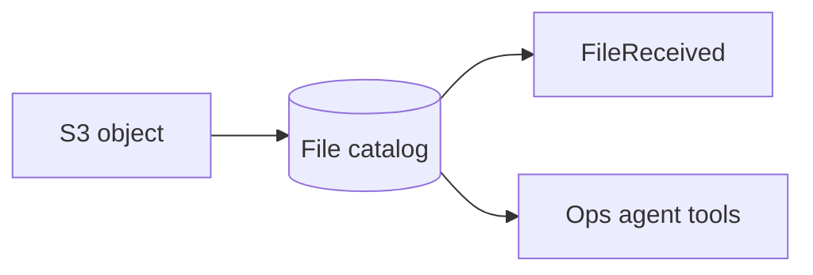

# Lesson 6.9 — Metadata

**Module:** 06 — Enterprise File Transfer  
**Duration:** 25–35 minutes  
**BayLearn philosophy:** WHY → WHEN → HOW. Pattern first. Technology second.

---

## Learning outcomes

By the end of this lesson you will be able to:

1. Define the file envelope.
2. Persist a catalog, not only S3 listings.
3. Feed observability and agents.

---

## Enterprise scenario

Checksum, partner ID, size, and correlation ID lived only in an email. The email was deleted. Metadata must travel with the object.

> **Fiction notice:** Named companies in this course (Northbridge Bank, Harbor Retail, CareMesh Health, Atlas Manufacturing) are instructional fictions.

---

## WHY this exists

Metadata is the file’s envelope: who, when, what schema version, checksum, correlation, sensitivity. Store it in object metadata and in an operational table. Events should copy a subset. Without metadata you cannot duplicate-detect or audit.

---

## WHEN an Enterprise Architect uses it

- Every landed file.
- Cross-system tracing from SFTP user to posting.

### When NOT to use it

- Storing the entire CSV as “metadata.”
- Sensitive data in unencrypted user-defined metadata that lands in logs.

---

## HOW — the pattern (vendor-neutral)

On land: capture Transfer user, source IP (if available), size, etag/checksum, parsed name fields. Write a DynamoDB item FileId → metadata. Emit FileReceived with pointers. This is what the AI ops agent will query in Module 15.

### Architecture diagram

---

## HOW — AWS implementation (after the pattern)

S3 user-metadata (size limits), DynamoDB catalog, EventBridge detail. Lab 6 writes a catalog item.

Do not start here. If you cannot explain the requirement and pattern without naming an AWS service, you are not ready to select technology.

---

## Anti-patterns

- Metadata only in Slack.
- No correlation ID on file events.

---

## Tradeoffs

| Dimension | Benefit | Cost / risk |
|-----------|---------|-------------|
| Catalog table | Queryable ops | Must stay in sync with S3 |
| S3 inventory only | Cheap | Slow, awkward queries |

---

## Architecture decision prompt

Which metadata must be queryable by “did partner ABC send today’s settlement?” without listing the entire bucket?

Write four sentences: the requirement, the integration characteristics, the pattern, and why the rejected options fail the NFRs.

---

## Knowledge check

**Q1.** Why not rely on S3 list as the catalog?

*Answer.* List is not a business query API, is slower, and lacks partner/SLA fields you need.

---

## Architect's note

The banking ops agent is a metadata consumer. Design the table for those questions.

---

## Next

Complete any architecture challenge attached to this lesson in the course player. Record an ADR fragment if the decision would survive a design review.
