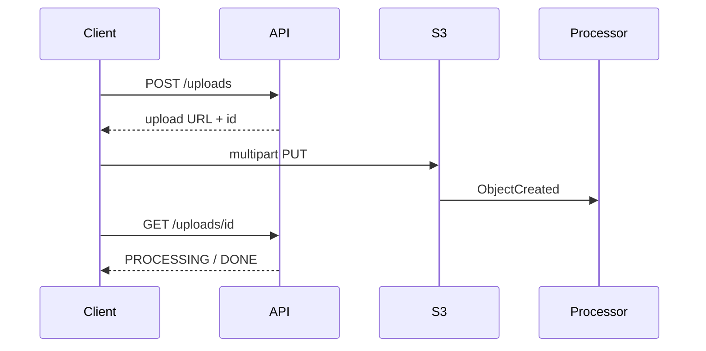

# Lesson 7.1 — Why Large Payloads Break Synchronous APIs

**Module:** 07 — Large File Architecture  
**Duration:** 25–35 minutes  
**BayLearn philosophy:** WHY → WHEN → HOW. Pattern first. Technology second.

---

## Learning outcomes

By the end of this lesson you will be able to:

1. Quantify gateway, proxy, and function limits as NFRs.
2. Explain memory and timeout physics.
3. Choose claim-check + async status as the default large-file API.

---

## Enterprise scenario

A client posts 25 GB to API Gateway. It will not work. The architecture was wrong before the first byte.

> **Fiction notice:** Named companies in this course (Northbridge Bank, Harbor Retail, CareMesh Health, Atlas Manufacturing) are instructional fictions.

---

## WHY this exists

Synchronous HTTP APIs are built for modest representations. Gateways cap body size and time. Load balancers idle-timeout. Lambdas cap memory and duration. Even if you raised every timeout, holding a multi-GB buffer in a request thread is an expensive way to copy to S3. Large payloads need **out-of-band transfer**.

---

## WHEN an Enterprise Architect uses it

- Any payload approaching gateway limits (far earlier than 25 GB—think tens of MB as a smell).
- Long-running processing after upload.

### When NOT to use it

- Keeping a 50 GB video inside DynamoDB.
- SQS as a transport for the bytes.

---

## HOW — the pattern (vendor-neutral)

API issues a short-lived upload location (presigned URL or Transfer instruction), client uploads directly to object storage (multipart), platform emits ObjectCreated, processor works async, client polls/status-subscribes. This is Lab 7.

### Architecture diagram

---

## HOW — AWS implementation (after the pattern)

API Gateway + Lambda for init/status only. S3 multipart. EventBridge on object created. Processing Lambda/ECS. DynamoDB status. Never the bytes through the gateway.

Do not start here. If you cannot explain the requirement and pattern without naming an AWS service, you are not ready to select technology.

---

## Anti-patterns

- Raising API Gateway limits as the strategy.
- Putting base64 in JSON.

---

## Tradeoffs

| Dimension | Benefit | Cost / risk |
|-----------|---------|-------------|
| Direct upload | Scales to GB | Client must speak S3/multipart |
| Proxied upload | Simple HTTP POST | Hard limits |

---

## Architecture decision prompt

Which of A) API Gateway B) direct object storage C) SQS D) DynamoDB is acceptable for 25 GB, and why are the others physically or economically wrong?

Write four sentences: the requirement, the integration characteristics, the pattern, and why the rejected options fail the NFRs.

---

## Knowledge check

**Q1.** What does the API return on init?

*Answer.* An upload locator, a file/job ID, and possibly part size hints—not 201 processed.

---

## Architect's note

This is the architecture challenge example in the course spec. Students must explain, not guess.

---

## Next

Complete any architecture challenge attached to this lesson in the course player. Record an ADR fragment if the decision would survive a design review.
