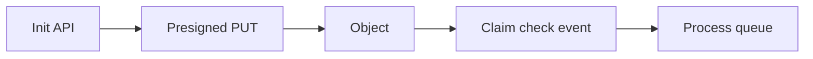

# Lesson 7.2 — Presigned Uploads and Claim Check

**Module:** 07 — Large File Architecture  
**Duration:** 25–35 minutes  
**BayLearn philosophy:** WHY → WHEN → HOW. Pattern first. Technology second.

---

## Learning outcomes

By the end of this lesson you will be able to:

1. Issue time-boxed, least-privilege upload credentials.
2. Bind uploads to a job ID and expected checksum.
3. Treat the object URI as the claim check for later messages.

---

## Enterprise scenario

An open bucket “uploads/” with public write became a malware hotel. Presigning exists to avoid that.

> **Fiction notice:** Named companies in this course (Northbridge Bank, Harbor Retail, CareMesh Health, Atlas Manufacturing) are instructional fictions.

---

## WHY this exists

Presigned URLs grant a specific operation on a specific key for a short time. The server chooses the key (job ID). After upload, events carry the claim check: bucket, key, version, size, checksum. Downstream queues never contain bytes.

---

## WHEN an Enterprise Architect uses it

- Browser and partner HTTPS uploads to S3.
- When you do not want Transfer Family for a one-off large object (still may want SFTP for partners).

### When NOT to use it

- Long-lived presigns (days) with write to *.
- Client-chosen keys in a shared prefix without isolation.

---

## HOW — the pattern (vendor-neutral)

Init API authenticates, creates catalog row PENDING, returns presign for PUT/multipart. Complete API or S3 event verifies size/checksum, marks LANDED, starts pipeline. Expire abandoned PENDING.

### Architecture diagram

---

## HOW — AWS implementation (after the pattern)

s3 generate_presigned_url / presigned POST. KMS via bucket encryption. Lab 7 implements init + client upload + event.

Do not start here. If you cannot explain the requirement and pattern without naming an AWS service, you are not ready to select technology.

---

## Anti-patterns

- Public-write prefix.
- Presign expiry of one week for a 2-minute upload.

---

## Tradeoffs

| Dimension | Benefit | Cost / risk |
|-----------|---------|-------------|
| Presign | No public bucket | Clock skew and expiry UX |
| Transfer Family | Partner SFTP | Hourly cost |

---

## Architecture decision prompt

If the presign allows PUT to any key, what is the threat?

Write four sentences: the requirement, the integration characteristics, the pattern, and why the rejected options fail the NFRs.

---

## Knowledge check

**Q1.** What is a claim check?

*Answer.* A reference to a large payload stored elsewhere, carried by messages/events instead of the payload itself.

---

## Architect's note

Least privilege applies to temporary creds too.

---

## Next

Complete any architecture challenge attached to this lesson in the course player. Record an ADR fragment if the decision would survive a design review.
