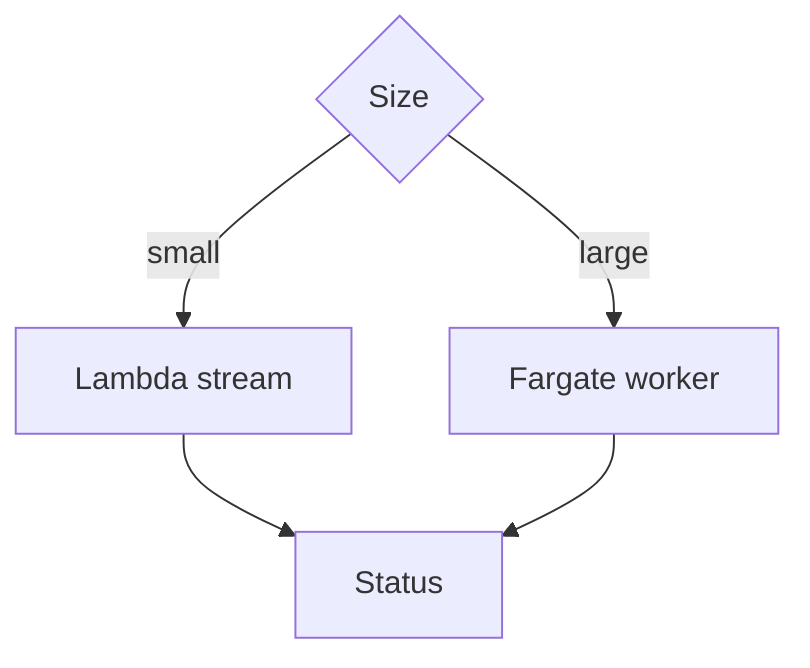

# Lesson 7.3 — Multipart, Streaming, and Worker Choice

**Module:** 07 — Large File Architecture  
**Duration:** 25–35 minutes  
**BayLearn philosophy:** WHY → WHEN → HOW. Pattern first. Technology second.

---

## Learning outcomes

By the end of this lesson you will be able to:

1. Use multipart upload for reliability and parallelism.
2. Stream in workers; watch Lambda size/time.
3. Escalate to ECS/Fargate when hashing/scanning GB-scale.

---

## Enterprise scenario

A 10 GB file hashed in a 2 GB Lambda OOM-killed forever. Worker choice is an architecture decision.

> **Fiction notice:** Named companies in this course (Northbridge Bank, Harbor Retail, CareMesh Health, Atlas Manufacturing) are instructional fictions.

---

## WHY this exists

Multipart allows resume and parallel parts. Processors should stream (hash, scan, parse) with bounded memory. Lambda is excellent for control-plane and modest files; Fargate/ECS/batch for heavy CPU, long time, or huge memory. Do not be heroic.

---

## WHEN an Enterprise Architect uses it

- Files above a documented threshold (e.g. 500 MB) go to Fargate.
- Small files stay on Lambda for cost.

### When NOT to use it

- One Lambda memory setting for all sizes.
- Loading entire files into BytesIO “for convenience.”

---

## HOW — the pattern (vendor-neutral)

Threshold table in the ADR. Step Functions chooses the worker. Checkpoints for parse. Virus scan as a required stage for untrusted sources.

### Architecture diagram

---

## HOW — AWS implementation (after the pattern)

S3 multipart, Lambda vs ECS (see also the file-transfer course Lab 9). Lab 7 can process small files with Lambda and document the threshold; do not pretend 50 GB on Lambda.

Do not start here. If you cannot explain the requirement and pattern without naming an AWS service, you are not ready to select technology.

---

## Anti-patterns

- multipart abandoned parts leaking cost.
- No abort of incomplete uploads.

---

## Tradeoffs

| Dimension | Benefit | Cost / risk |
|-----------|---------|-------------|
| Lambda | Cheap, simple | Hard limits |
| Fargate | Power | VPC/image complexity and cost per run |

---

## Architecture decision prompt

At 100 MB, 1 GB, 10 GB, 50 GB: which worker and why?

Write four sentences: the requirement, the integration characteristics, the pattern, and why the rejected options fail the NFRs.

---

## Knowledge check

**Q1.** Why stream the hash?

*Answer.* To keep memory O(1) relative to file size and to fail fast on truncation.

---

## Architect's note

Incomplete multipart uploads cost money. Lifecycle abort rules are architecture.

---

## Next

Complete any architecture challenge attached to this lesson in the course player. Record an ADR fragment if the decision would survive a design review.
