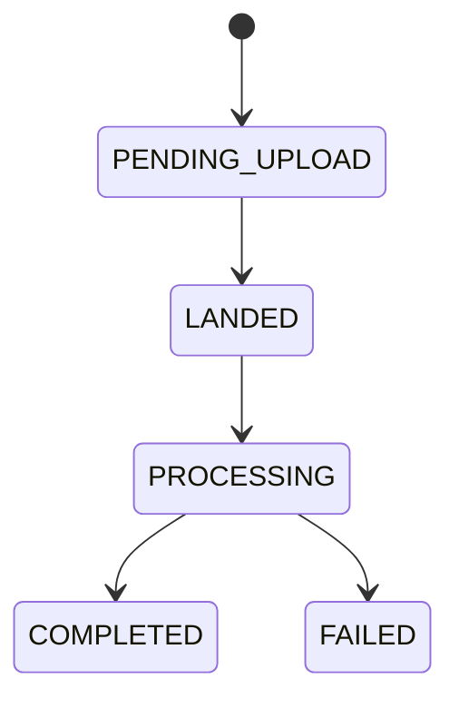

# Lesson 7.4 — Asynchronous Status Patterns

**Module:** 07 — Large File Architecture  
**Duration:** 25–35 minutes  
**BayLearn philosophy:** WHY → WHEN → HOW. Pattern first. Technology second.

---

## Learning outcomes

By the end of this lesson you will be able to:

1. Offer GET status, webhooks, and events for completion.
2. Make status the UX contract for long work.
3. Never block the init HTTP call on processing.

---

## Enterprise scenario

Mobile uploaded 2 GB and the app froze waiting. Status patterns exist so UX can be honest.

> **Fiction notice:** Named companies in this course (Northbridge Bank, Harbor Retail, CareMesh Health, Atlas Manufacturing) are instructional fictions.

---

## WHY this exists

202 Accepted + job resource is the API analog of “message received.” Status values: PENDING_UPLOAD, LANDED, VALIDATING, PROCESSING, COMPLETED, FAILED. Clients poll with backoff or subscribe to events. Webhooks need signing and retries.

---

## WHEN an Enterprise Architect uses it

- Any work longer than a gateway timeout.
- Human-visible long jobs.

### When NOT to use it

- Spin-waiting in the init Lambda until processing ends.
- Unverified webhooks to customer URLs.

---

## HOW — the pattern (vendor-neutral)

Status in DynamoDB. GET /uploads/{id}. Event FileProcessed. Optional websocket/SNS. Include percent or stage, error code, correlation ID. Lab 7 requires GET status.

### Architecture diagram

---

## HOW — AWS implementation (after the pattern)

API Gateway GET to Lambda to DynamoDB. EventBridge for push. Same correlation ID as the file catalog.

Do not start here. If you cannot explain the requirement and pattern without naming an AWS service, you are not ready to select technology.

---

## Anti-patterns

- Status 200 with empty body meaning unknown.
- Job IDs that are sequential and guessable for other tenants.

---

## Tradeoffs

| Dimension | Benefit | Cost / risk |
|-----------|---------|-------------|
| Poll | Easy clients | Load if naive |
| Push events | Efficient | Client must subscribe |

---

## Architecture decision prompt

Poll every 50 ms vs exponential backoff: which harms the platform, and how do you document the client contract?

Write four sentences: the requirement, the integration characteristics, the pattern, and why the rejected options fail the NFRs.

---

## Knowledge check

**Q1.** What HTTP status on init when processing will take minutes?

*Answer.* 202 Accepted (or 201 created of a job resource)—not 200 completed.

---

## Architect's note

Guessable job IDs are an IDOR waiting to happen. Use unguessable IDs plus authz.

---

## Next

Complete any architecture challenge attached to this lesson in the course player. Record an ADR fragment if the decision would survive a design review.
