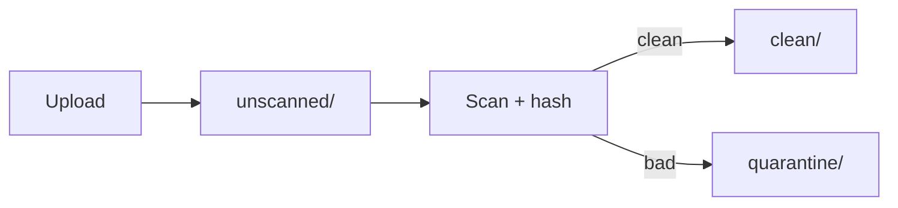

# Lesson 7.5 — Integrity, Malware, and Poison Large Objects

**Module:** 07 — Large File Architecture  
**Duration:** 25–35 minutes  
**BayLearn philosophy:** WHY → WHEN → HOW. Pattern first. Technology second.

---

## Learning outcomes

By the end of this lesson you will be able to:

1. Scan untrusted files before they fan out.
2. Quarantine without blocking the entire landing zone.
3. Bound resource usage so zip bombs cannot take down workers.

---

## Enterprise scenario

A 200 KB zip expanded to 40 GB in a parser. Large-file architecture includes hostile files, not just honest CAD.

> **Fiction notice:** Named companies in this course (Northbridge Bank, Harbor Retail, CareMesh Health, Atlas Manufacturing) are instructional fictions.

---

## WHY this exists

Untrusted bytes: malware scan, archive bomb limits, max rows, max expansion ratio, timeouts. Fail to quarantine. Do not notify twenty systems with a pointer to malware. Security and reliability meet here.

---

## WHEN an Enterprise Architect uses it

- Any external upload.
- Any file that will be opened by internal users.

### When NOT to use it

- Skipping scan “because it is CSV.”
- Scanning only after posting to the ledger.

---

## HOW — the pattern (vendor-neutral)

Stage: land to unscanned prefix → scan/hash → promote. Resource limits on workers. Circuit-break a partner who sends bombs. Capstone 3 is strict here.

### Architecture diagram

---

## HOW — AWS implementation (after the pattern)

Separate prefixes, possibly a scanning engine on Fargate, GuardDuty malware protection for S3 where appropriate. Lab 7 at least enforces size and checksum; document scan as required in production ADRs.

Do not start here. If you cannot explain the requirement and pattern without naming an AWS service, you are not ready to select technology.

---

## Anti-patterns

- Everyone can read unscanned.
- No max-bytes on parsers.

---

## Tradeoffs

| Dimension | Benefit | Cost / risk |
|-----------|---------|-------------|
| Sync scan before event | Safer fan-out | Longer time to first event |
| Async scan | Faster ingest | Risk of premature consume |

---

## Architecture decision prompt

Where does the object live while unscanned, and which roles can read it?

Write four sentences: the requirement, the integration characteristics, the pattern, and why the rejected options fail the NFRs.

---

## Knowledge check

**Q1.** Should FileReceived fire from the unscanned prefix?

*Answer.* Generally no for untrusted sources. Fire FileLandedUnscanned internally if needed, FileReceived after promotion.

---

## Architect's note

Hostile files are a reliability incident and a security incident. Design both.

---

## Next

Complete any architecture challenge attached to this lesson in the course player. Record an ADR fragment if the decision would survive a design review.
