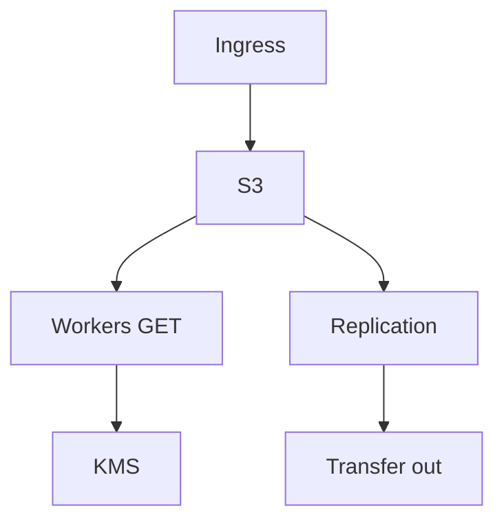

# Lesson 7.6 — Cost and Performance at GB Scale

**Module:** 07 — Large File Architecture  
**Duration:** 25–35 minutes  
**BayLearn philosophy:** WHY → WHEN → HOW. Pattern first. Technology second.

---

## Learning outcomes

By the end of this lesson you will be able to:

1. Model S3 request, transfer, KMS, and compute cost.
2. Avoid NAT and cross-AZ chatter for huge copies.
3. Put cost in the ADR next to latency.

---

## Enterprise scenario

A “simple” cross-region copy of nightly 50 GB × 50 partners became a five-figure bill. Large-file architecture is FinOps.

> **Fiction notice:** Named companies in this course (Northbridge Bank, Harbor Retail, CareMesh Health, Atlas Manufacturing) are instructional fictions.

---

## WHY this exists

Cost drivers: storage, PUT parts, GET by workers, KMS per object, Transfer Family hours, NAT if you hairpin, inter-region replication, failed retries that re-read. Performance: parallelism of parts, worker placement, checksum CPU. Architects estimate before they bless the pattern.

---

## WHEN an Enterprise Architect uses it

- Any design above a few GB/day.
- Multi-region DR copies.

### When NOT to use it

- Ignoring KMS request costs on millions of tiny files (different problem) or GB-scale re-hashes every retry.

---

## HOW — the pattern (vendor-neutral)

Estimate: volume × size × GET/PUT counts × region. Cache checksums. Don’t re-download on every consumer—claim-check plus one processor that emits small facts. Lifecycle incomplete uploads.

### Architecture diagram

---

## HOW — AWS implementation (after the pattern)

S3 pricing, Transfer Family, Data Transfer. Lab 7 should stay tiny (sample files). Capstone 4 must include a cost paragraph for 50 partners × 20 GB.

Do not start here. If you cannot explain the requirement and pattern without naming an AWS service, you are not ready to select technology.

---

## Anti-patterns

- NAT gateway for S3 from private subnets without a gateway endpoint.
- Three consumers each downloading the 50 GB object.

---

## Tradeoffs

| Dimension | Benefit | Cost / risk |
|-----------|---------|-------------|
| Replicate everything | DR | Transfer cost |
| Reprocess from origin | Cheaper storage | RTO risk |

---

## Architecture decision prompt

50 partners × 20 GB nightly × 30 days: what is the dominant cost if you also copy to a second region?

Write four sentences: the requirement, the integration characteristics, the pattern, and why the rejected options fail the NFRs.

---

## Knowledge check

**Q1.** Why can retries explode cost at GB scale?

*Answer.* Each retry may GET the object again and re-burn CPU/KMS. Idempotent checkpoints save money, not only correctness.

---

## Architect's note

Module 14’s 20 GB × 50 orgs challenge is this lesson with a calculator.

---

## Next

Complete any architecture challenge attached to this lesson in the course player. Record an ADR fragment if the decision would survive a design review.
