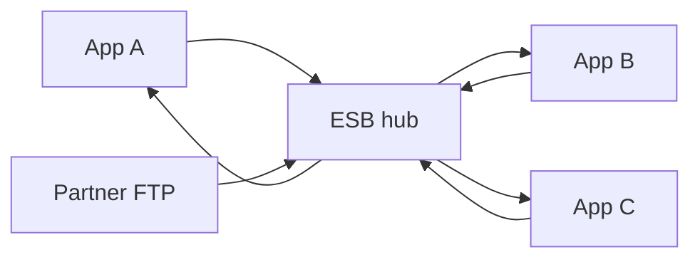

# Lesson 8.1 — What Is an ESB?

**Module:** 08 — ESB and Traditional Enterprise Integration  
**Duration:** 25–35 minutes  
**BayLearn philosophy:** WHY → WHEN → HOW. Pattern first. Technology second.

---

## Learning outcomes

By the end of this lesson you will be able to:

1. Define an Enterprise Service Bus as a centralized mediation hub.
2. List routing, transformation, protocol bridging, and orchestration as typical bus jobs.
3. Separate the useful pattern (anti-corruption, adapter) from the organizational failure mode (the bus team owns every mapping).

---

## Enterprise scenario

Northbridge’s “integration” is a cluster that every project waits on. New products queue for six weeks to get an ESB mapping. The bus solved 2008’s protocol zoo and created 2026’s bottleneck.

> **Fiction notice:** Named companies in this course (Northbridge Bank, Harbor Retail, CareMesh Health, Atlas Manufacturing) are instructional fictions.

---

## WHY this exists

An ESB is a **hub** that sits between applications to route, transform, and mediate protocols so endpoints do not couple directly. It was a rational response to SOAP, MQ, FTP, and vendor adapters. It becomes harmful when it is the only place business logic can change, when every team must release through one pipeline, and when the canonical model is a political object. Architects must understand ESBs well enough to modernize them—not parody them.

---

## WHEN an Enterprise Architect uses it

- You inherit one.
- A protocol cannot be changed this year (adapter).
- A regulated transformation must stay in a controlled layer temporarily.

### When NOT to use it

- Greenfield service-to-service JSON inside one domain.
- Using a new ESB to avoid designing APIs and events.

---

## HOW — the pattern (vendor-neutral)

Draw the bus as: endpoints, adapters, canonical messages, routing rules, transformation maps, operational console. Identify which of those you still need (adapters) versus which you will distribute (routing via events, transforms in services).

### Architecture diagram

---

## HOW — AWS implementation (after the pattern)

There is no single “AWS ESB.” People simulate one with a mega Lambda, an iPaaS, or EventBridge-plus-everything. Resist the simulation. Use adapters (containers, commercial connectors) at the edge and distributed patterns inside.

Do not start here. If you cannot explain the requirement and pattern without naming an AWS service, you are not ready to select technology.

---

## Anti-patterns

- Rewriting the ESB in Lambda and calling it cloud-native.
- Pretending the bus does not exist in the inventory.

---

## Tradeoffs

| Dimension | Benefit | Cost / risk |
|-----------|---------|-------------|
| Hub | Fewer pairwise protocols | Central bottleneck and coupling |
| Distributed | Team autonomy | Need contracts and platform skill |

---

## Architecture decision prompt

If you were forbidden from adding a mapping for 90 days, which business changes would halt? That is the coupling cost of the bus.

Write four sentences: the requirement, the integration characteristics, the pattern, and why the rejected options fail the NFRs.

---

## Knowledge check

**Q1.** What problem did the ESB originally solve?

*Answer.* N-squared protocol and mapping connections among heterogeneous enterprise systems.

---

## Architect's note

Respect the bus: it still moves money. Modernize with a strangler, not a sneer.

---

## Next

Complete any architecture challenge attached to this lesson in the course player. Record an ADR fragment if the decision would survive a design review.
