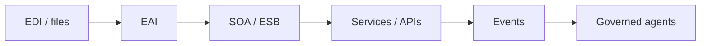

# Lesson 8.2 — Enterprise Integration History

**Module:** 08 — ESB and Traditional Enterprise Integration  
**Duration:** 25–35 minutes  
**BayLearn philosophy:** WHY → WHEN → HOW. Pattern first. Technology second.

---

## Learning outcomes

By the end of this lesson you will be able to:

1. Place RPC, EDI, EAI, SOA/ESB, microservices, iPaaS, and events on a timeline of problems—not fashion.
2. Explain why each wave left residue in the estate.
3. Use history to talk to executives who bought the last wave.

---

## Enterprise scenario

A steering committee wants “to skip to agents.” The estate still has EDI, a SOAP bus, and REST. History tells you you will wrap, not skip.

> **Fiction notice:** Named companies in this course (Northbridge Bank, Harbor Retail, CareMesh Health, Atlas Manufacturing) are instructional fictions.

---

## WHY this exists

EDI and files connected companies before the internet was a product. EAI tools mapped packaged apps. SOA/ESB promised reuse via a hub. Microservices promised autonomous deploys. iPaaS promised faster maps in the cloud. Events promised decoupling. Agents now promise natural language. Each wave addresses a real pain and leaves **residue**: skills, contracts, vendors, and risk. Architects sequence coexistence.

---

## WHEN an Enterprise Architect uses it

- Executive education.
- Migration roadmaps.
- Vendor evaluations.

### When NOT to use it

- Using history to mock the current operations team.
- Assuming the newest wave deletes the others this quarter.

---

## HOW — the pattern (vendor-neutral)

Inventory which wave each integration belongs to. Do not mix layers accidentally (agent writing to EDI without a tool). Roadmap: stabilize, expose, strangler, decommission.

### Architecture diagram

---

## HOW — AWS implementation (after the pattern)

AWS itself is multi-wave: Transfer Family (files), API Gateway (API), EventBridge (events), Bedrock (agents). The platform is a timeline. Use it as such.

Do not start here. If you cannot explain the requirement and pattern without naming an AWS service, you are not ready to select technology.

---

## Anti-patterns

- Greenfield-only diagrams presented as current state.
- Agent washing the ESB.

---

## Tradeoffs

| Dimension | Benefit | Cost / risk |
|-----------|---------|-------------|
| Coexistence | Lower risk | More complexity now |
| Big bang rewrite | Clean story | Outage and budget risk |

---

## Architecture decision prompt

Why would an agent project fail if EDI still is the legal contract with a supplier?

Write four sentences: the requirement, the integration characteristics, the pattern, and why the rejected options fail the NFRs.

---

## Knowledge check

**Q1.** What is residue?

*Answer.* Contracts, skills, vendors, and systems that remain after the next architectural wave is announced.

---

## Architect's note

Your job is often translation between waves, not purity.

---

## Next

Complete any architecture challenge attached to this lesson in the course player. Record an ADR fragment if the decision would survive a design review.
