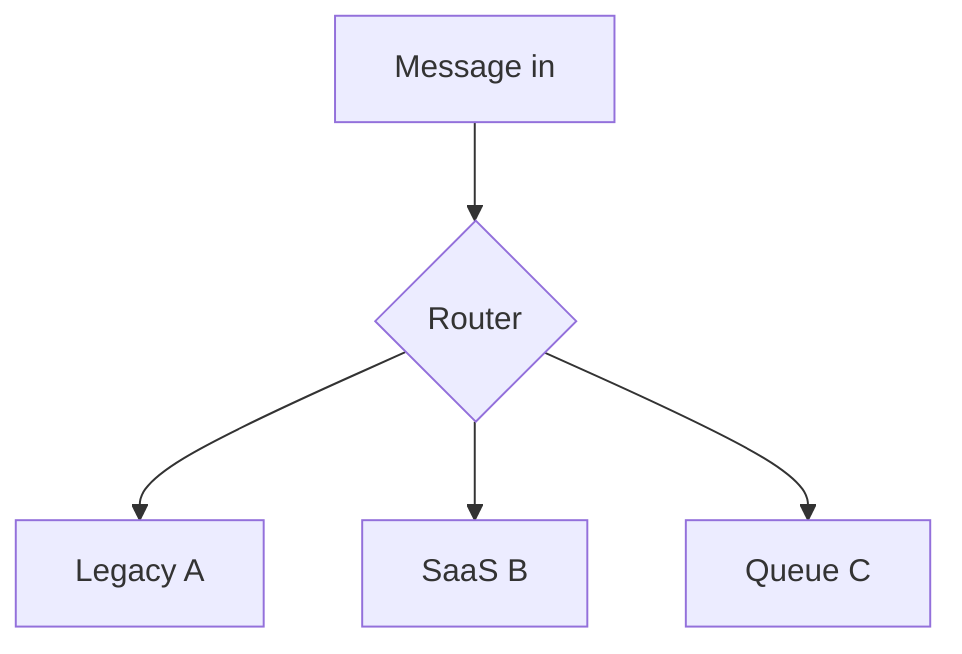

# Lesson 8.3 — Routing on a Bus

**Module:** 08 — ESB and Traditional Enterprise Integration  
**Duration:** 25–35 minutes  
**BayLearn philosophy:** WHY → WHEN → HOW. Pattern first. Technology second.

---

## Learning outcomes

By the end of this lesson you will be able to:

1. Describe content-based and address-based routing in a hub.
2. Show how routing tables become untestable.
3. Compare hub routing to EventBridge rules and to service-owned routing.

---

## Enterprise scenario

A single routing artifact with 4,000 paths cannot be code-reviewed. Production is the test. That is why distributed routing is attractive—and why you must not recreate 4,000 EventBridge rules without tests.

> **Fiction notice:** Named companies in this course (Northbridge Bank, Harbor Retail, CareMesh Health, Atlas Manufacturing) are instructional fictions.

---

## WHY this exists

Buses route by address, header, or payload. Central routing gives a single place to look and a single place to break. Distributed routing (each service subscribes) scales ownership but needs discovery and schema discipline.

---

## WHEN an Enterprise Architect uses it

- When endpoints cannot change and a hub already routes.
- When a temporary anti-corruption layer must send to the right legacy program.

### When NOT to use it

- Growing the central table as the default for every new microservice.

---

## HOW — the pattern (vendor-neutral)

If you keep hub routing, treat it as code: version, test, review. If you move to events, move **ownership** of subscriptions with the consumer. Measure path count.

### Architecture diagram

---

## HOW — AWS implementation (after the pattern)

EventBridge rules, API Gateway routes, Step Functions choices—all can become mini-buses. Apply the same hygiene.

Do not start here. If you cannot explain the requirement and pattern without naming an AWS service, you are not ready to select technology.

---

## Anti-patterns

- Routing in production-only XML.
- Copying the XML into Lambda unchanged.

---

## Tradeoffs

| Dimension | Benefit | Cost / risk |
|-----------|---------|-------------|
| Central router | Visibility of paths | Change contention |
| Consumer subscription | Autonomy | Harder global picture unless you inventory |

---

## Architecture decision prompt

Who is paged when a routing change drops payments but not email?

Write four sentences: the requirement, the integration characteristics, the pattern, and why the rejected options fail the NFRs.

---

## Knowledge check

**Q1.** What makes a routing table untestable?

*Answer.* Volume of undocumented, environment-specific, payload-parsed paths without fixtures.

---

## Architect's note

Path count is a modernization KPI.

---

## Next

Complete any architecture challenge attached to this lesson in the course player. Record an ADR fragment if the decision would survive a design review.
