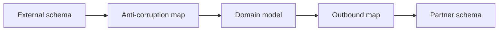

# Lesson 8.4 — Transformation

**Module:** 08 — ESB and Traditional Enterprise Integration  
**Duration:** 25–35 minutes  
**BayLearn philosophy:** WHY → WHEN → HOW. Pattern first. Technology second.

---

## Learning outcomes

By the end of this lesson you will be able to:

1. Place transformation at anti-corruption boundaries.
2. Warn against a single canonical transform for all meanings.
3. Prefer explicit maps in versioned code over opaque GUI maps.

---

## Enterprise scenario

The bus maps “customer” 70 ways. Nobody knows which map finance uses. Transformation without tests is a silent ledger bug.

> **Fiction notice:** Named companies in this course (Northbridge Bank, Harbor Retail, CareMesh Health, Atlas Manufacturing) are instructional fictions.

---

## WHY this exists

Transformation is necessary because schemas differ. It is dangerous because it can change meaning (amount in cents vs dollars). Own maps with the boundary that understands both sides, version them, test with golden files, and log both sides’ IDs.

---

## WHEN an Enterprise Architect uses it

- Protocol/schema edges you do not control.
- Partner files to internal events.

### When NOT to use it

- Transforming inside the core domain for every consumer’s whim (that is an API product problem).
- Lossy maps that drop audit fields.

---

## HOW — the pattern (vendor-neutral)

Anti-corruption layer (ACL): inbound map to domain, outbound map to partner. Golden tests. Do not dual-write two meanings of amount.

### Architecture diagram

---

## HOW — AWS implementation (after the pattern)

Lambda/ESB maps, Glue for analytics (different purpose). Keep payment transforms in tightly reviewed code with fixtures in sample-data.

Do not start here. If you cannot explain the requirement and pattern without naming an AWS service, you are not ready to select technology.

---

## Anti-patterns

- GUI mapping with no git history.
- Silent default values for missing amounts.

---

## Tradeoffs

| Dimension | Benefit | Cost / risk |
|-----------|---------|-------------|
| Central maps | Reuse | Meaning collisions |
| Per-boundary maps | Clear meaning | Some duplication |

---

## Architecture decision prompt

If a map changes 100.00 to 10000 “for the mainframe,” where is that documented and tested?

Write four sentences: the requirement, the integration characteristics, the pattern, and why the rejected options fail the NFRs.

---

## Knowledge check

**Q1.** What is an anti-corruption layer?

*Answer.* A boundary that translates another system’s model without letting that model leak into your domain.

---

## Architect's note

Golden file tests are cheaper than reconciliation incidents.

---

## Next

Complete any architecture challenge attached to this lesson in the course player. Record an ADR fragment if the decision would survive a design review.
