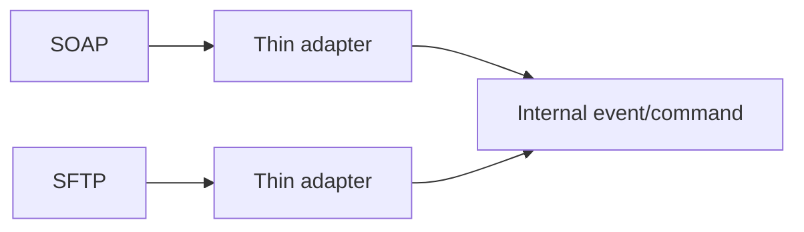

# Lesson 8.5 — Protocol Mediation

**Module:** 08 — ESB and Traditional Enterprise Integration  
**Duration:** 25–35 minutes  
**BayLearn philosophy:** WHY → WHEN → HOW. Pattern first. Technology second.

---

## Learning outcomes

By the end of this lesson you will be able to:

1. Treat adapters as first-class: SOAP, MQ, SFTP, FHIR, ISO 20022.
2. Do not require partners to speak your internal protocol.
3. Keep adapters thin: protocol in, domain message out.

---

## Enterprise scenario

A plant speaks OPC-UA. Finance speaks SFTP. The agent speaks HTTPS. Mediation is how they coexist. The mistake is a thick adapter that also prices orders.

> **Fiction notice:** Named companies in this course (Northbridge Bank, Harbor Retail, CareMesh Health, Atlas Manufacturing) are instructional fictions.

---

## WHY this exists

Protocol mediation converts transport and framing, not business policy. Thin adapters: terminate SOAP, emit an internal command/event. Thick adapters become another ESB. Inventory protocols in the integration catalog.

---

## WHEN an Enterprise Architect uses it

- Any legacy or partner protocol you cannot retire this year.
- When a strangler needs a façade.

### When NOT to use it

- New internal services inventing SOAP “for consistency with 2009.”
- Business rules in the adapter.

---

## HOW — the pattern (vendor-neutral)

One adapter per protocol family where possible. Health checks. Separate deploy from domain services. Capstone 4 still needs an ERP adapter.

### Architecture diagram

---

## HOW — AWS implementation (after the pattern)

API Gateway for HTTP façades, Transfer Family for SFTP, MQ on EC2/Amazon MQ for JMS, FHIR APIs for health. Amazon does not erase HL7 v2 in a hospital; an adapter does.

Do not start here. If you cannot explain the requirement and pattern without naming an AWS service, you are not ready to select technology.

---

## Anti-patterns

- One “universal adapter” microservice.
- Plant protocol terminated on a laptop.

---

## Tradeoffs

| Dimension | Benefit | Cost / risk |
|-----------|---------|-------------|
| Thin adapter | Replaceable | Domain must still validate |
| Thick adapter | Fast field mapping | Hidden business logic |

---

## Architecture decision prompt

Should the adapter or the domain service own duplicate detection?

Write four sentences: the requirement, the integration characteristics, the pattern, and why the rejected options fail the NFRs.

---

## Knowledge check

**Q1.** What should a thin adapter not do?

*Answer.* Credit decisions, pricing, or other domain policy.

---

## Architect's note

Adapters are how honesty about residue looks in an architecture diagram.

---

## Next

Complete any architecture challenge attached to this lesson in the course player. Record an ADR fragment if the decision would survive a design review.
