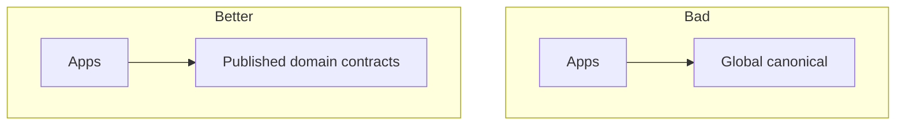

# Lesson 8.6 — Canonical Data Models

**Module:** 08 — ESB and Traditional Enterprise Integration  
**Duration:** 25–35 minutes  
**BayLearn philosophy:** WHY → WHEN → HOW. Pattern first. Technology second.

---

## Learning outcomes

By the end of this lesson you will be able to:

1. Use canonical models narrowly or not at all.
2. Prefer published language at the boundary.
3. Show how a global Customer object becomes a committee.

---

## Enterprise scenario

The enterprise Customer canonical type took 18 months and still fit no mobile screen. Canonical models are gravity wells.

> **Fiction notice:** Named companies in this course (Northbridge Bank, Harbor Retail, CareMesh Health, Atlas Manufacturing) are instructional fictions.

---

## WHY this exists

A canonical model is a shared representation all parties map to. It reduces N×N maps to N×2 in theory. In practice, competing meanings stall change. Prefer **bounded published events/APIs** per domain, with maps at edges. A small canonical for a specific network (payments ISO, FHIR resources) is different from a company-wide über-object.

---

## WHEN an Enterprise Architect uses it

- Industry standards you should not reinvent (FHIR, ISO 20022) as *external* published language.
- A small hub with truly identical semantics.

### When NOT to use it

- A single object for all meanings of customer, order, and product across 80 apps.
- Blocking delivery until the canonical is finished.

---

## HOW — the pattern (vendor-neutral)

If you inherit a canonical, freeze it, wrap it, and stop extending it except for compliance. New domains publish their own contracts.

### Architecture diagram

---

## HOW — AWS implementation (after the pattern)

Event schemas and OpenAPI are published language. Do not create a DynamoDB “canonical table” everyone writes.

Do not start here. If you cannot explain the requirement and pattern without naming an AWS service, you are not ready to select technology.

---

## Anti-patterns

- Canonical field “misc.”
- Stopping APIs until the model is perfect.

---

## Tradeoffs

| Dimension | Benefit | Cost / risk |
|-----------|---------|-------------|
| Canonical hub | Fewer maps in theory | Slow politics |
| Domain contracts | Speed | Some translation |

---

## Architecture decision prompt

FHIR as canonical for health interoperability vs an internal über-Patient table: which is a standard and which is a swamp?

Write four sentences: the requirement, the integration characteristics, the pattern, and why the rejected options fail the NFRs.

---

## Knowledge check

**Q1.** When is a canonical model justified?

*Answer.* When semantics truly match or an industry standard already is the language—not as a hope to unify politics.

---

## Architect's note

Industry standards ≠ your internal ER diagram. Do not confuse them.

---

## Next

Complete any architecture challenge attached to this lesson in the course player. Record an ADR fragment if the decision would survive a design review.
