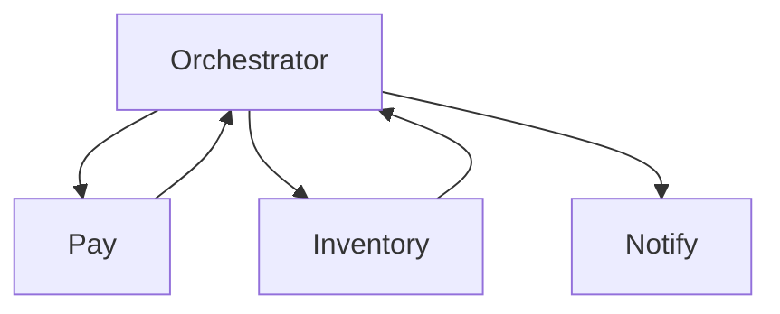

# Lesson 8.7 — Service Orchestration on the Bus

**Module:** 08 — ESB and Traditional Enterprise Integration  
**Duration:** 25–35 minutes  
**BayLearn philosophy:** WHY → WHEN → HOW. Pattern first. Technology second.

---

## Learning outcomes

By the end of this lesson you will be able to:

1. Distinguish orchestration (a conductor) from choreography (events).
2. Show why the ESB became a process engine.
3. Place sagas in visible workflow tools, not hidden maps.

---

## Enterprise scenario

Order-to-cash on the bus calls seven systems synchronously. One timeout rolls up as “ESB down.” Orchestration without isolation is a distributed monolith.

> **Fiction notice:** Named companies in this course (Northbridge Bank, Harbor Retail, CareMesh Health, Atlas Manufacturing) are instructional fictions.

---

## WHY this exists

Orchestration is useful when the process is the product (onboarding, claims adjudication) and compensations are required. The ESB often hid these processes in proprietary flows. Modernization should **make the process visible** (state machine) and **keep steps idempotent**, not delete process.

---

## WHEN an Enterprise Architect uses it

- Long-running processes with branches and human tasks.
- When choreography would obscure legal sequence.

### When NOT to use it

- Every CRUD as a process.
- Orchestrating independent notifications that should be events.

---

## HOW — the pattern (vendor-neutral)

Choose choreography for independent facts; orchestration for a business transaction with a completion state. Module 10 sagas. Lab 8 asks what stays on a conductor.

### Architecture diagram

---

## HOW — AWS implementation (after the pattern)

Step Functions vs EventBridge-only. iPaaS process designers. The AWS name is not the point; visibility and compensations are.

Do not start here. If you cannot explain the requirement and pattern without naming an AWS service, you are not ready to select technology.

---

## Anti-patterns

- Sync fan-out from the bus to seven systems with one timeout.
- Process XML that nobody can diff.

---

## Tradeoffs

| Dimension | Benefit | Cost / risk |
|-----------|---------|-------------|
| Orchestration | Visible sequence and compensations | Conductor as coupling point |
| Choreography | Independence | Harder to see the process |

---

## Architecture decision prompt

Should “email the receipt” be a step in the orchestrator or a subscriber to OrderCompleted?

Write four sentences: the requirement, the integration characteristics, the pattern, and why the rejected options fail the NFRs.

---

## Knowledge check

**Q1.** What is a distributed monolith?

*Answer.* Independently named services that can only change or stay up together because of a hidden central process or data model.

---

## Architect's note

If the process is legally load-bearing, it deserves a diagram and tests, not a hidden map.

---

## Next

Complete any architecture challenge attached to this lesson in the course player. Record an ADR fragment if the decision would survive a design review.
