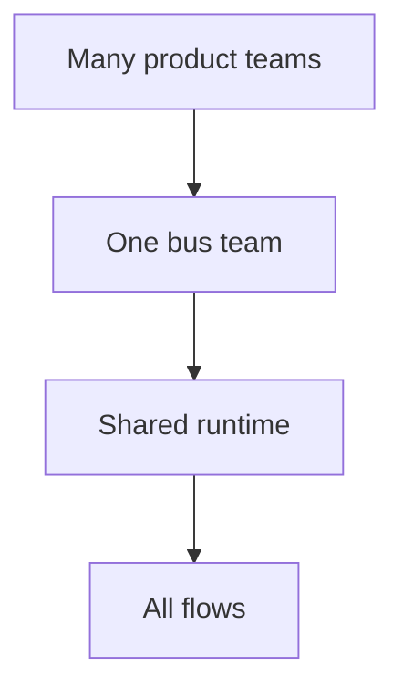

# Lesson 8.8 — Problems with Centralized ESB Architectures

**Module:** 08 — ESB and Traditional Enterprise Integration  
**Duration:** 25–35 minutes  
**BayLearn philosophy:** WHY → WHEN → HOW. Pattern first. Technology second.

---

## Learning outcomes

By the end of this lesson you will be able to:

1. Name bottlenecks, coupling, governance overhead, scaling, and deployment dependencies.
2. Turn problems into modernization drivers with metrics.
3. Avoid blaming individuals who kept the lights on.

---

## Enterprise scenario

Every release of the bus stops unrelated projects. Weekend change freezes. This is the problem list you will use in Lab 8’s ADR.

> **Fiction notice:** Named companies in this course (Northbridge Bank, Harbor Retail, CareMesh Health, Atlas Manufacturing) are instructional fictions.

---

## WHY this exists

Bottlenecks: finite bus team throughput. Coupling: shared canonical and shared runtime. Governance overhead: CAB for a field map. Scaling: vertical or awkward clustering. Deployment dependencies: one bad map breaks many flows. Cost: licenses plus delay. These are **architectural** problems. The people operating the bus are often the only reason the company still settles.

---

## WHEN an Enterprise Architect uses it

- Justifying a strangler.
- Setting KPIs: lead time for a new mapping, incident blast radius, deploy coupling.

### When NOT to use it

- Big-bang rewrite as the first move.
- No metrics, only aesthetics (“not cloud”).

---

## HOW — the pattern (vendor-neutral)

Measure mapping lead time, change failure rate, blast radius. Pick strangler candidates: high-change, low-risk flows first. Keep the bus for low-change protocol edges. That is Module 9.

### Architecture diagram

---

## HOW — AWS implementation (after the pattern)

Moving to API Gateway/EventBridge/SQS does not automatically fix governance. You can rebuild the bottleneck as a central “platform PR required for every schema.” Design federated contracts.

Do not start here. If you cannot explain the requirement and pattern without naming an AWS service, you are not ready to select technology.

---

## Anti-patterns

- Modernization with no KPI.
- Cutting over the settlement flow first to “prove value.”

---

## Tradeoffs

| Dimension | Benefit | Cost / risk |
|-----------|---------|-------------|
| Keep ESB forever | Predictable to incumbents | Delay and concentration risk |
| Modernize | Autonomy and scale | Need skills and dual-run |

---

## Architecture decision prompt

Which two metrics would you put on an executive slide to fund modernization?

Write four sentences: the requirement, the integration characteristics, the pattern, and why the rejected options fail the NFRs.

---

## Knowledge check

**Q1.** Name five centralized ESB problems from this lesson.

*Answer.* Bottlenecks, coupling, governance overhead, scaling limits, deployment dependencies (blast radius).

---

## Architect's note

Lab 8’s ADR should quote this problem list with numbers, even if estimated.

---

## Next

Complete any architecture challenge attached to this lesson in the course player. Record an ADR fragment if the decision would survive a design review.
