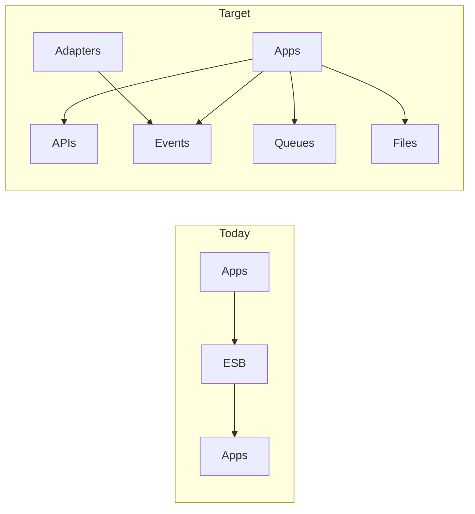

# Lesson 9.1 — From Hub to Distributed Cloud Integration

**Module:** 09 — ESB Modernization  
**Duration:** 25–35 minutes  
**BayLearn philosophy:** WHY → WHEN → HOW. Pattern first. Technology second.

---

## Learning outcomes

By the end of this lesson you will be able to:

1. Sketch the target: APIs, events, queues, files, thin adapters.
2. Keep the bus where it still earns its place.
3. Use cloud services as implementations of styles, not as the strategy.

---

## Enterprise scenario

Leadership wants “all on EventBridge by December.” Settlement is still ISO on MQ. A target that ignores residue is a fantasy.

> **Fiction notice:** Named companies in this course (Northbridge Bank, Harbor Retail, CareMesh Health, Atlas Manufacturing) are instructional fictions.

---

## WHY this exists

The target architecture is a **platform of styles**: API products, event backbone, work queues, file landing, and a shrinking adapter tier. Cloud mappings: API Gateway, EventBridge, SQS, S3/Transfer, containers for leftover protocols, Step Functions for visible orchestration. The strategy is distribution of ownership, not a new hub brand.

---

## WHEN an Enterprise Architect uses it

- Any ESB modernization program.
- When new domains should not be allowed onto the bus.

### When NOT to use it

- A second ESB in the cloud.
- Forcing MQ partners to REST in one quarter.

---

## HOW — the pattern (vendor-neutral)

Draw current (apps → ESB → apps) and target (apps → style-appropriate edges). Policy: new integrations cannot add bus maps without an exception ADR. Platform teams provide golden paths.

### Architecture diagram

---

## HOW — AWS implementation (after the pattern)

The AWS list in the course spec is the toolbox. Lab 8 uses it to redesign a given legacy diagram.

Do not start here. If you cannot explain the requirement and pattern without naming an AWS service, you are not ready to select technology.

---

## Anti-patterns

- Lift the ESB to a VM in AWS.
- EventBridge as the new canonical model committee.

---

## Tradeoffs

| Dimension | Benefit | Cost / risk |
|-----------|---------|-------------|
| Distributed styles | Autonomy | Need platform + skills |
| Cloud hub iPaaS as new ESB | Familiar ops | Same bottleneck in a new bill |

---

## Architecture decision prompt

What remains on the bus in 18 months, and who pays for that remaining license?

Write four sentences: the requirement, the integration characteristics, the pattern, and why the rejected options fail the NFRs.

---

## Knowledge check

**Q1.** What is the policy that actually changes behavior?

*Answer.* New work defaults off the bus; exceptions require ADRs—not a slide that says “event-driven.”

---

## Architect's note

Target state is a portfolio, not a single service.

---

## Next

Complete any architecture challenge attached to this lesson in the course player. Record an ADR fragment if the decision would survive a design review.
