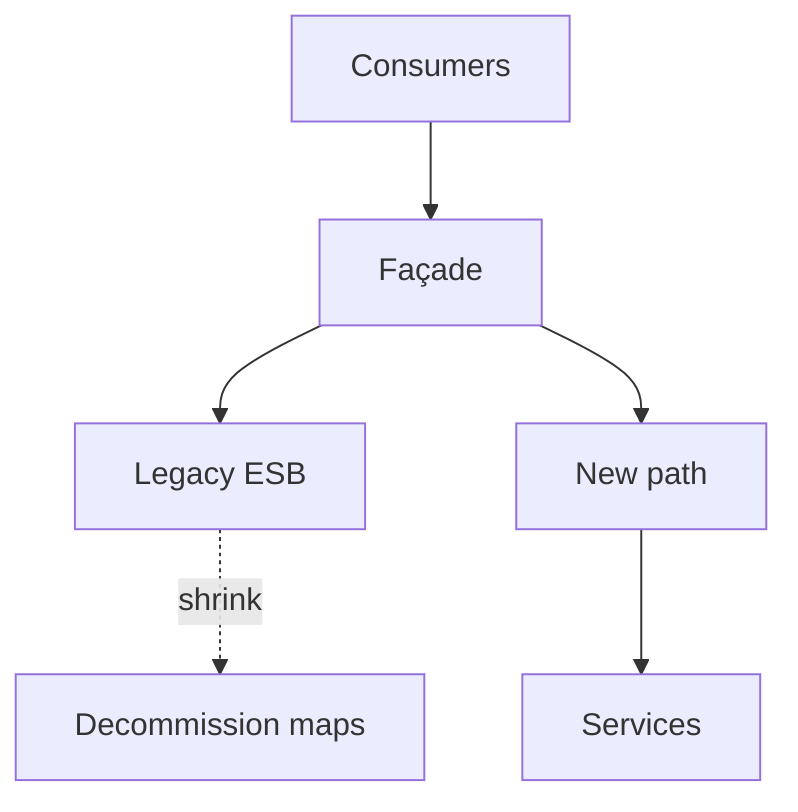

# Lesson 9.2 — Strangler Fig for Integrations

**Module:** 09 — ESB Modernization  
**Duration:** 25–35 minutes  
**BayLearn philosophy:** WHY → WHEN → HOW. Pattern first. Technology second.

---

## Learning outcomes

By the end of this lesson you will be able to:

1. Apply strangler: façade, intercept, replace, shrink.
2. Pick candidate flows with risk × change rate.
3. Keep dual-run and comparison for money flows.

---

## Enterprise scenario

A team rewired settlement first because it was “the most important.” They learned why stranglers start at the edges.

> **Fiction notice:** Named companies in this course (Northbridge Bank, Harbor Retail, CareMesh Health, Atlas Manufacturing) are instructional fictions.

---

## WHY this exists

The strangler fig pattern wraps a legacy system with a façade, migrates capabilities incrementally, and shrinks the legacy. For ESBs, the façade may be an API or file gateway that still calls the bus internally, then one flow at a time moves to native cloud integration. Dual-run and reconcilers protect correctness.

---

## WHEN an Enterprise Architect uses it

- Any production bus you cannot stop.
- When you can intercept at a protocol edge.

### When NOT to use it

- Rewriting all maps offline for a weekend cutover as plan A.
- Strangling without traffic metrics.

---

## HOW — the pattern (vendor-neutral)

Steps: inventory, façade, choose a low-blast high-learning flow, dual-run, switch reads, switch writes, remove map, repeat. Lab 8 requires a strangler sequence in the ADR.

### Architecture diagram

---

## HOW — AWS implementation (after the pattern)

API Gateway as façade, feature flags in DynamoDB, shadow traffic to new SQS path, reconcilers in S3/Athena if needed. Keep Transfer Family façade if SFTP is the intercept point.

Do not start here. If you cannot explain the requirement and pattern without naming an AWS service, you are not ready to select technology.

---

## Anti-patterns

- No rollback for the façade.
- Calling the project done when 10% of maps remain but they are the money maps.

---

## Tradeoffs

| Dimension | Benefit | Cost / risk |
|-----------|---------|-------------|
| Strangler | Safer | Dual-run cost |
| Cutover | Fast if it works | High ruin probability |

---

## Architecture decision prompt

Order the strangler of: (a) marketing email, (b) card settlement, (c) partner SFTP catalog. Why that order?

Write four sentences: the requirement, the integration characteristics, the pattern, and why the rejected options fail the NFRs.

---

## Knowledge check

**Q1.** What is shadow traffic?

*Answer.* Sending a copy of production inputs to the new path without taking the production write, then comparing outcomes.

---

## Architect's note

The last 10% of maps are often the reason the bus exists. Plan them; do not forget them.

---

## Next

Complete any architecture challenge attached to this lesson in the course player. Record an ADR fragment if the decision would survive a design review.
