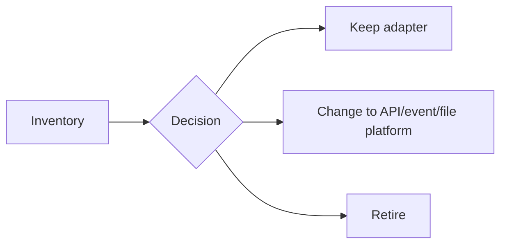

# Lesson 9.3 — What Stays, What Changes, Why

**Module:** 09 — ESB Modernization  
**Duration:** 25–35 minutes  
**BayLearn philosophy:** WHY → WHEN → HOW. Pattern first. Technology second.

---

## Learning outcomes

By the end of this lesson you will be able to:

1. Build a keep/change/retire table for an ESB estate.
2. Justify each row with NFRs, not taste.
3. Identify migration risks explicitly.

---

## Enterprise scenario

Lab 8’s entire point. Students who “move everything to Lambda” fail the ADR.

> **Fiction notice:** Named companies in this course (Northbridge Bank, Harbor Retail, CareMesh Health, Atlas Manufacturing) are instructional fictions.

---

## WHY this exists

Keep: stable protocol adapters with few changes, certified transforms, low-churn partner maps. Change: high-churn digital products, new domains, anything blocked by bus lead time. Retire: duplicate maps, dead partners, canonical fields nobody reads. Risks: dual meaning of amounts, unidentified consumers, license terms, staff skills, undetected point-to-point that bypasses the bus already.

---

## WHEN an Enterprise Architect uses it

- Every modernization ADR.
- Vendor renewal conversations.

### When NOT to use it

- Keep/change decided by who shouts.
- Retire without a consumer inventory.

---

## HOW — the pattern (vendor-neutral)

Table columns: flow, style now, style later, keep/change/retire, risk, measure of done. Lab 8 uses this table.

### Architecture diagram

---

## HOW — AWS implementation (after the pattern)

Technology later: maybe Amazon MQ remains for a plant, Transfer Family for SFTP, EventBridge for digital facts. The table comes first.

Do not start here. If you cannot explain the requirement and pattern without naming an AWS service, you are not ready to select technology.

---

## Anti-patterns

- Retire column empty.
- Change column = everything.

---

## Tradeoffs

| Dimension | Benefit | Cost / risk |
|-----------|---------|-------------|
| Keep adapters | Risk down | License lingers |
| Change digital first | Visible wins | Bus still critical |

---

## Architecture decision prompt

Pick one flow you would keep on an adapter for 24 months and defend it.

Write four sentences: the requirement, the integration characteristics, the pattern, and why the rejected options fail the NFRs.

---

## Knowledge check

**Q1.** Why might a stable ISO20022 MQ flow stay?

*Answer.* Low change rate, high correctness risk, certified mapping, partner cannot move—NFR-driven keep.

---

## Architect's note

This table is the Lab 8 deliverable. Quality here matters more than Terraform.

---

## Next

Complete any architecture challenge attached to this lesson in the course player. Record an ADR fragment if the decision would survive a design review.
